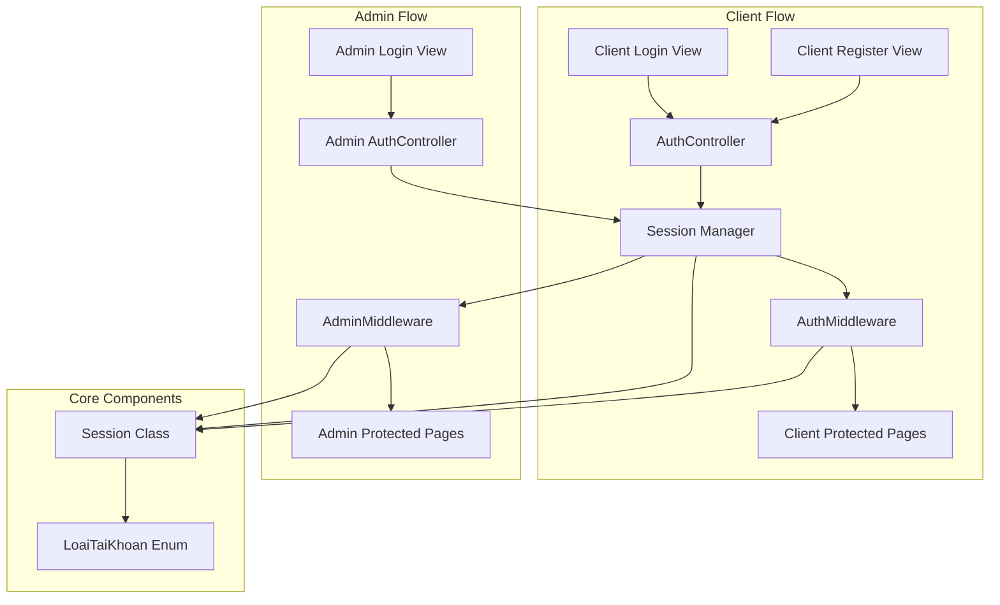
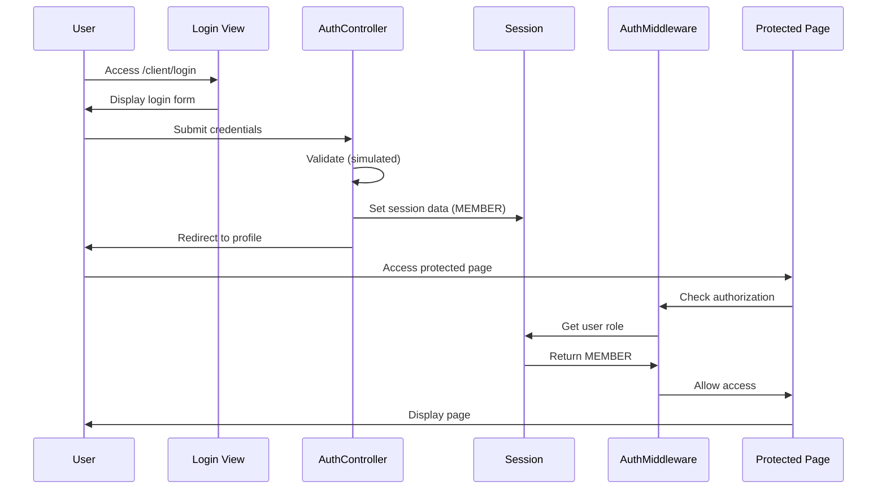
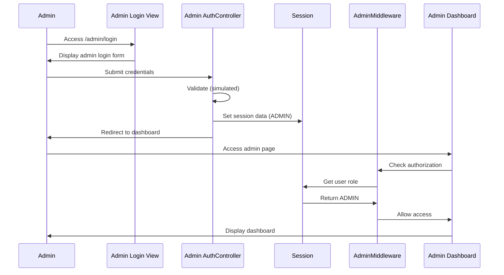

# Design Document: Authentication Authorization System

## Overview

Hệ thống xác thực và phân quyền cho ứng dụng PHP thuần, sử dụng OOP và session-based authentication. Hệ thống cung cấp hai luồng đăng nhập riêng biệt cho khách hàng (MEMBER) và quản trị viên (ADMIN), với middleware bảo vệ các trang theo vai trò.

### Key Design Goals

- Session-based authentication sử dụng $_SESSION
- Role-based access control (RBAC) với hai vai trò: MEMBER và ADMIN
- Middleware pattern cho authorization
- Simulated authentication (không cần database) để phát triển nhanh
- Tách biệt hoàn toàn giữa client và admin authentication flows
- Bootstrap 5 responsive UI

### Technology Stack

- PHP 7.4+ (OOP thuần)
- Session management với $_SESSION
- Bootstrap 5 CDN
- Không sử dụng database (simulated authentication)

## Architecture

### High-Level Architecture



### Authentication Flow

**Client Authentication Flow:**


**Admin Authentication Flow:**


### Directory Structure

```
app/
├── controllers/
│   ├── client/
│   │   └── AuthController.php          # Client authentication logic
│   └── admin/
│       └── AuthController.php          # Admin authentication logic
├── middleware/
│   ├── AuthMiddleware.php              # Client authorization
│   └── AdminMiddleware.php             # Admin authorization
├── core/
│   └── Session.php                     # Session management (existing)
├── enums/
│   └── LoaiTaiKhoan.php               # Role constants (existing)
└── views/
    ├── client/
    │   └── auth/
    │       ├── login.php               # Client login view
    │       └── register.php            # Client register view
    └── admin/
        └── auth/
            └── login.php               # Admin login view
```

## Components and Interfaces

### 1. AuthMiddleware Class

**Purpose:** Kiểm tra quyền truy cập cho các trang khách hàng (MEMBER only)

**Location:** `app/middleware/AuthMiddleware.php`

**Interface:**
```php
class AuthMiddleware
{
    /**
     * Kiểm tra xem user có phải MEMBER đã đăng nhập không
     * Redirect đến client login nếu không phải MEMBER
     */
    public static function checkMember(): void;
}
```

**Behavior:**
- Guest → Redirect to `/client/login`
- ADMIN → Redirect to `/client/login` (require re-authentication as MEMBER)
- MEMBER → Allow access

**Usage Example:**
```php
// At top of protected client page
<?php
require_once __DIR__ . '/../../middleware/AuthMiddleware.php';
AuthMiddleware::checkMember();
?>
```

### 2. AdminMiddleware Class

**Purpose:** Kiểm tra quyền truy cập cho các trang quản trị (ADMIN only)

**Location:** `app/middleware/AdminMiddleware.php`

**Interface:**
```php
class AdminMiddleware
{
    /**
     * Kiểm tra xem user có phải ADMIN đã đăng nhập không
     * Redirect đến admin login hoặc homepage tùy trường hợp
     */
    public static function checkAdmin(): void;
}
```

**Behavior:**
- Guest → Redirect to `/admin/login`
- MEMBER → Redirect to homepage with message "Không có quyền truy cập"
- ADMIN → Allow access

**Usage Example:**
```php
// At top of protected admin page
<?php
require_once __DIR__ . '/../../middleware/AdminMiddleware.php';
AdminMiddleware::checkAdmin();
?>
```

### 3. Client AuthController

**Purpose:** Xử lý đăng nhập và đăng ký cho khách hàng

**Location:** `app/controllers/client/AuthController.php`

**Interface:**
```php
class AuthController
{
    /**
     * Xử lý đăng nhập khách hàng (simulated)
     * @param string $email
     * @param string $password
     * @return bool Success status
     */
    public static function login(string $email, string $password): bool;
    
    /**
     * Xử lý đăng ký khách hàng (simulated)
     * @param string $email
     * @param string $password
     * @param string $name
     * @return bool Success status
     */
    public static function register(string $email, string $password, string $name): bool;
    
    /**
     * Xử lý đăng xuất
     */
    public static function logout(): void;
}
```

**Simulated Authentication Logic:**
- Login: Accept any valid email format + non-empty password
- Register: Accept any valid email format + non-empty password + non-empty name
- Set session with role = 'MEMBER'
- Redirect to `/client/profile` on success

### 4. Admin AuthController

**Purpose:** Xử lý đăng nhập cho quản trị viên

**Location:** `app/controllers/admin/AuthController.php`

**Interface:**
```php
class AuthController
{
    /**
     * Xử lý đăng nhập admin (simulated)
     * @param string $email
     * @param string $password
     * @return bool Success status
     */
    public static function login(string $email, string $password): bool;
    
    /**
     * Xử lý đăng xuất admin
     */
    public static function logout(): void;
}
```

**Simulated Authentication Logic:**
- Login: Accept any valid email format + non-empty password
- Set session with role = 'ADMIN'
- Redirect to `/admin/dashboard` on success

### 5. Session Class (Existing)

**Purpose:** Quản lý session data

**Location:** `app/core/Session.php` (already exists)

**Key Methods Used:**
```php
Session::start(): void
Session::set(string $key, $value): void
Session::get(string $key, $default = null)
Session::isLoggedIn(): bool
Session::getUserRole(): ?string
Session::login(array $user): void
Session::logout(): void
Session::isAdmin(): bool
```

**Session Data Structure:**
```php
$_SESSION = [
    'user_id' => int,
    'user_email' => string,
    'user_name' => string,
    'user_role' => 'MEMBER' | 'ADMIN',
    'user_avatar' => string|null
];
```

### 6. LoaiTaiKhoan Enum (Existing)

**Purpose:** Define role constants

**Location:** `app/enums/LoaiTaiKhoan.php` (already exists)

**Constants:**
```php
LoaiTaiKhoan::ADMIN = 'ADMIN'
LoaiTaiKhoan::MEMBER = 'MEMBER'
```

## Data Models

### Session Data Model

Không có database model, chỉ sử dụng session data:

```php
// Session structure for authenticated user
[
    'user_id' => 1,                    // Simulated ID
    'user_email' => 'user@example.com',
    'user_name' => 'Nguyen Van A',
    'user_role' => 'MEMBER',           // or 'ADMIN'
    'user_avatar' => null              // Optional
]
```

### Simulated User Data

Vì không sử dụng database, authentication sẽ được simulate như sau:

**For Client (MEMBER):**
```php
// Any valid email + non-empty password = success
$simulatedUser = [
    'id' => 1,
    'email' => $_POST['email'],
    'ho_ten' => $_POST['name'] ?? 'User',
    'loai_tai_khoan' => LoaiTaiKhoan::MEMBER,
    'avatar_url' => null
];
```

**For Admin:**
```php
// Any valid email + non-empty password = success
$simulatedAdmin = [
    'id' => 999,
    'email' => $_POST['email'],
    'ho_ten' => 'Administrator',
    'loai_tai_khoan' => LoaiTaiKhoan::ADMIN,
    'avatar_url' => null
];
```

### View Data Requirements

**Client Login View (`views/client/auth/login.php`):**
- Bootstrap 5 CDN
- Email input field
- Password input field
- Submit button
- Link to register page
- Form action to client auth controller

**Client Register View (`views/client/auth/register.php`):**
- Bootstrap 5 CDN
- Email input field
- Password input field
- Name input field
- Submit button
- Link to login page
- Form action to client auth controller

**Admin Login View (`views/admin/auth/login.php`):**
- Bootstrap 5 CDN
- Title: "Cổng quản trị nội bộ"
- Email input field
- Password input field
- Submit button
- NO register link
- Form action to admin auth controller


## Correctness Properties

*A property is a characteristic or behavior that should hold true across all valid executions of a system-essentially, a formal statement about what the system should do. Properties serve as the bridge between human-readable specifications and machine-verifiable correctness guarantees.*

### Property 1: MEMBER Authentication Sets Correct Role

*For any* successful MEMBER authentication (login or registration), the system SHALL set `$_SESSION['loai_tai_khoan']` to 'MEMBER'.

**Validates: Requirements 1.5, 1.6**

### Property 2: ADMIN Authentication Sets Correct Role

*For any* successful ADMIN login, the system SHALL set `$_SESSION['loai_tai_khoan']` to 'ADMIN'.

**Validates: Requirements 2.4**

### Property 3: MEMBER Login Redirect

*For any* successful MEMBER login, the system SHALL redirect to Client_Profile_Page.

**Validates: Requirements 1.7, 6.1**

### Property 4: MEMBER Registration Redirect

*For any* successful MEMBER registration, the system SHALL redirect to Client_Profile_Page.

**Validates: Requirements 1.8, 6.3**

### Property 5: ADMIN Login Redirect

*For any* successful ADMIN login, the system SHALL redirect to Admin_Dashboard_Page.

**Validates: Requirements 2.5, 6.2**

### Property 6: Guest Access to Client Pages Denied

*For any* unauthenticated user (Guest) attempting to access a protected client page, the AuthMiddleware SHALL redirect to Client_Login_View.

**Validates: Requirements 3.2**

### Property 7: Admin Access to Client Pages Denied

*For any* authenticated ADMIN user attempting to access a protected client page, the AuthMiddleware SHALL redirect to Client_Login_View (requiring re-authentication as MEMBER).

**Validates: Requirements 3.3, 6.4**

### Property 8: MEMBER Access to Client Pages Allowed

*For any* authenticated MEMBER user attempting to access a protected client page, the AuthMiddleware SHALL allow access without redirection.

**Validates: Requirements 3.4**

### Property 9: Guest Access to Admin Pages Denied

*For any* unauthenticated user (Guest) attempting to access a protected admin page, the AdminMiddleware SHALL redirect to Admin_Login_View.

**Validates: Requirements 4.2**

### Property 10: MEMBER Access to Admin Pages Denied

*For any* authenticated MEMBER user attempting to access a protected admin page, the AdminMiddleware SHALL redirect to the homepage with message "Không có quyền truy cập".

**Validates: Requirements 4.3, 10.1**

### Property 11: ADMIN Access to Admin Pages Allowed

*For any* authenticated ADMIN user attempting to access a protected admin page, the AdminMiddleware SHALL allow access without redirection.

**Validates: Requirements 4.4**

### Property 12: Complete Session Data Storage

*For any* successful authentication (login or registration), the system SHALL store at minimum the following keys in $_SESSION: user_id, user_email, user_name, and loai_tai_khoan.

**Validates: Requirements 5.1, 5.2, 8.5**

### Property 13: Logout Clears Session

*For any* logout operation, the system SHALL clear all user-related session data (user_id, user_email, user_name, user_role, user_avatar).

**Validates: Requirements 5.3**

### Property 14: Session Persistence

*For any* authenticated session, the session data SHALL persist across multiple page requests until logout or session expiration.

**Validates: Requirements 5.4**

### Property 15: Login Input Validation

*For any* valid email format and non-empty password, the simulated login SHALL succeed and create an authenticated session.

**Validates: Requirements 8.3**

### Property 16: Registration Input Validation

*For any* valid email format, non-empty password, and non-empty name, the simulated registration SHALL succeed and create an authenticated session.

**Validates: Requirements 8.4**

## Error Handling

### Authentication Errors

**Invalid Input Handling:**
- Empty email → No authentication, remain on login/register page
- Invalid email format → No authentication, remain on login/register page
- Empty password → No authentication, remain on login/register page
- Empty name (registration) → No authentication, remain on register page

**Note:** Vì đây là simulated authentication, không có "wrong password" hoặc "user not found" errors. Mọi input hợp lệ đều thành công.

### Authorization Errors

**Access Denied Scenarios:**

1. **Guest accessing protected client page:**
   - Action: Redirect to `/client/login`
   - No error message displayed
   - Original URL not preserved

2. **Guest accessing protected admin page:**
   - Action: Redirect to `/admin/login`
   - No error message displayed
   - Original URL not preserved

3. **MEMBER accessing admin page:**
   - Action: Redirect to homepage
   - Display message: "Không có quyền truy cập"
   - Use session flash message or query parameter

4. **ADMIN accessing client page:**
   - Action: Redirect to `/client/login`
   - Require re-authentication as MEMBER
   - No error message displayed

### Session Errors

**Session Expiration:**
- PHP default session timeout applies
- Expired session treated as Guest
- Redirect to appropriate login page

**Session Hijacking Prevention:**
- Not implemented in this simulated version
- Future enhancement: session regeneration, IP checking

### Error Response Format

**Redirect-based Error Handling:**
```php
// For authorization failures
header('Location: /client/login');
exit;

// For MEMBER accessing admin pages
$_SESSION['error_message'] = 'Không có quyền truy cập';
header('Location: /');
exit;
```

**No JSON Error Responses:**
- This is a traditional server-side rendered application
- All errors handled via redirects and session messages
- No AJAX/API error responses needed

## Testing Strategy

### Dual Testing Approach

This feature requires both unit tests and property-based tests for comprehensive coverage:

- **Unit tests**: Verify specific examples, edge cases, and UI rendering
- **Property tests**: Verify universal properties across all inputs
- Both approaches are complementary and necessary

### Property-Based Testing

**Library:** Use [Pest PHP](https://pestphp.com/) with [pest-plugin-faker](https://github.com/pestphp/pest-plugin-faker) for property-based testing in PHP.

**Configuration:**
- Minimum 100 iterations per property test
- Each test must reference its design document property
- Tag format: `Feature: authentication-authorization-system, Property {number}: {property_text}`

**Property Test Examples:**

```php
// Property 1: MEMBER Authentication Sets Correct Role
test('MEMBER authentication sets correct role', function () {
    // Generate random valid credentials
    $email = fake()->email();
    $password = fake()->password();
    $name = fake()->name();
    
    // Test login
    Session::destroy();
    AuthController::login($email, $password);
    expect(Session::get('loai_tai_khoan'))->toBe('MEMBER');
    
    // Test registration
    Session::destroy();
    AuthController::register($email, $password, $name);
    expect(Session::get('loai_tai_khoan'))->toBe('MEMBER');
})->repeat(100)
  ->group('property-based')
  ->note('Feature: authentication-authorization-system, Property 1: MEMBER Authentication Sets Correct Role');

// Property 6: Guest Access to Client Pages Denied
test('guest access to client pages denied', function () {
    Session::destroy(); // Ensure guest state
    
    ob_start();
    AuthMiddleware::checkMember();
    $output = ob_get_clean();
    
    // Should redirect to login
    expect(headers_list())->toContain('Location: /client/login');
})->repeat(100)
  ->group('property-based')
  ->note('Feature: authentication-authorization-system, Property 6: Guest Access to Client Pages Denied');

// Property 12: Complete Session Data Storage
test('complete session data storage', function () {
    $email = fake()->email();
    $password = fake()->password();
    $name = fake()->name();
    
    Session::destroy();
    AuthController::register($email, $password, $name);
    
    // Check all required keys exist
    expect(Session::get('user_id'))->not->toBeNull();
    expect(Session::get('user_email'))->toBe($email);
    expect(Session::get('user_name'))->toBe($name);
    expect(Session::get('loai_tai_khoan'))->not->toBeNull();
})->repeat(100)
  ->group('property-based')
  ->note('Feature: authentication-authorization-system, Property 12: Complete Session Data Storage');
```

### Unit Testing

**Focus Areas:**
- UI rendering (Bootstrap CDN, form fields, links)
- Specific redirect scenarios
- Error message display
- Edge cases (empty inputs, malformed data)

**Unit Test Examples:**

```php
// Example 1: Client Login View Rendering
test('client login view renders correctly', function () {
    ob_start();
    include __DIR__ . '/../views/client/auth/login.php';
    $html = ob_get_clean();
    
    expect($html)->toContain('bootstrap');
    expect($html)->toContain('type="email"');
    expect($html)->toContain('type="password"');
    expect($html)->toContain('register');
})->group('unit');

// Example 2: Admin Login View Has No Register Link
test('admin login view has no register link', function () {
    ob_start();
    include __DIR__ . '/../views/admin/auth/login.php';
    $html = ob_get_clean();
    
    expect($html)->not->toContain('register');
    expect($html)->toContain('Cổng quản trị nội bộ');
})->group('unit');

// Example 3: Empty Password Rejected
test('empty password rejected', function () {
    $result = AuthController::login('test@example.com', '');
    expect($result)->toBeFalse();
    expect(Session::isLoggedIn())->toBeFalse();
})->group('unit');

// Example 4: Invalid Email Format Rejected
test('invalid email format rejected', function () {
    $result = AuthController::login('not-an-email', 'password123');
    expect($result)->toBeFalse();
    expect(Session::isLoggedIn())->toBeFalse();
})->group('unit');
```

### Integration Testing

**Scenarios to Test:**
1. Complete login flow: View → Controller → Session → Redirect
2. Complete registration flow: View → Controller → Session → Redirect
3. Protected page access flow: Request → Middleware → Session check → Allow/Deny
4. Logout flow: Logout → Session clear → Redirect to login
5. Cross-role access: ADMIN → Client page → Redirect to login

### Test Coverage Goals

- **Property tests**: Cover all 16 correctness properties
- **Unit tests**: Cover UI rendering, input validation, edge cases
- **Integration tests**: Cover complete user flows
- **Target coverage**: 90%+ code coverage for middleware and controllers

### Testing Utilities

**Helper Functions:**
```php
// Test helper to simulate authenticated session
function simulateAuthenticatedSession(string $role = 'MEMBER'): void {
    Session::start();
    Session::set('user_id', 1);
    Session::set('user_email', 'test@example.com');
    Session::set('user_name', 'Test User');
    Session::set('loai_tai_khoan', $role);
}

// Test helper to capture redirects
function captureRedirect(callable $callback): ?string {
    ob_start();
    $callback();
    ob_end_clean();
    
    $headers = headers_list();
    foreach ($headers as $header) {
        if (stripos($header, 'Location:') === 0) {
            return trim(substr($header, 9));
        }
    }
    return null;
}
```

### Manual Testing Checklist

- [ ] Client login with valid credentials → redirects to profile
- [ ] Client registration with valid data → redirects to profile
- [ ] Admin login with valid credentials → redirects to dashboard
- [ ] Guest accessing `/client/profile` → redirects to `/client/login`
- [ ] Guest accessing `/admin/dashboard` → redirects to `/admin/login`
- [ ] MEMBER accessing `/admin/dashboard` → redirects to homepage with error
- [ ] ADMIN accessing `/client/profile` → redirects to `/client/login`
- [ ] Logout from client → clears session, redirects to login
- [ ] Logout from admin → clears session, redirects to login
- [ ] Session persists across page navigation
- [ ] Bootstrap 5 styling displays correctly on all auth pages
- [ ] Responsive design works on mobile devices

