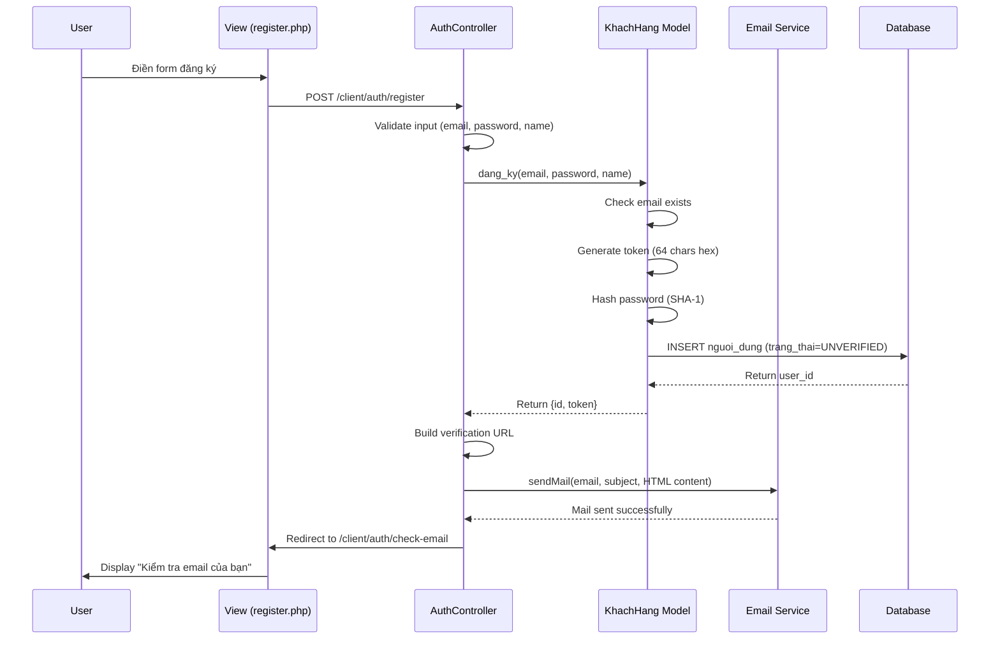
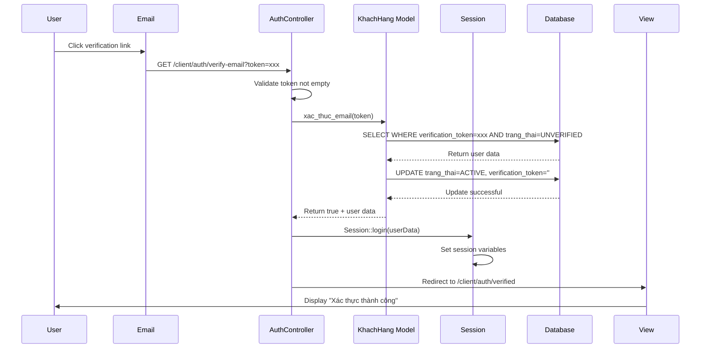
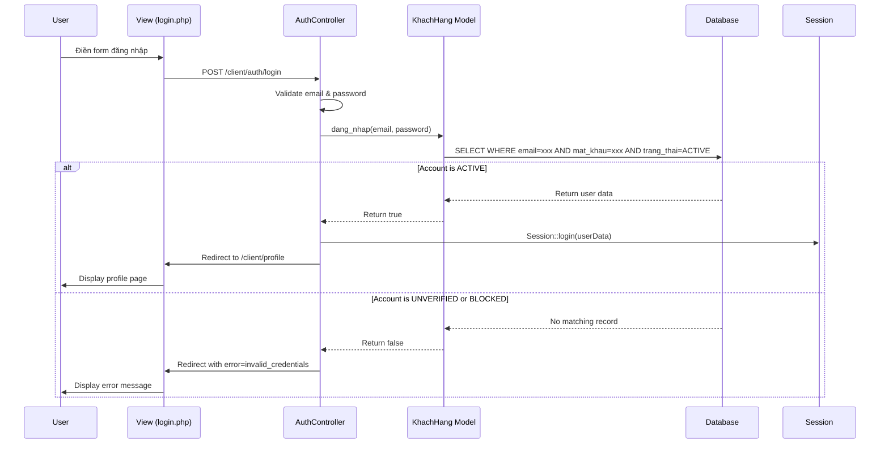

# Tài liệu Thiết kế - Xác thực Email khi Đăng ký

## Overview

Tính năng xác thực email đảm bảo rằng người dùng đăng ký với địa chỉ email hợp lệ và có quyền truy cập vào email đó. Hệ thống sẽ tạo tài khoản với trạng thái PENDING, gửi email chứa link xác thực có token duy nhất, và chỉ kích hoạt tài khoản khi người dùng nhấn vào link đó.

### Mục tiêu thiết kế

- Đảm bảo tính bảo mật: chỉ người có quyền truy cập email mới có thể kích hoạt tài khoản
- Ngăn chặn spam và tài khoản giả mạo
- Tự động đăng nhập sau khi xác thực thành công để cải thiện trải nghiệm người dùng
- Xử lý các trường hợp lỗi một cách rõ ràng và an toàn

### Phạm vi

Tính năng này bao gồm:
- Tạo tài khoản với trạng thái PENDING
- Sinh và lưu trữ verification token
- Gửi email xác thực với link chứa token
- Xử lý xác thực qua token
- Tự động đăng nhập sau xác thực thành công
- Ngăn chặn đăng nhập với tài khoản chưa xác thực
- Hiển thị các trang thông báo phù hợp

## Architecture

### Tổng quan kiến trúc

Hệ thống email verification được xây dựng theo mô hình MVC với các thành phần chính:

```
┌─────────────────┐
│   Client/User   │
└────────┬────────┘
         │
         ▼
┌─────────────────────────────────────────────────────────┐
│                    Presentation Layer                    │
│  ┌──────────────┐  ┌──────────────┐  ┌──────────────┐  │
│  │ register.php │  │check_email.php│ │ verified.php │  │
│  └──────────────┘  └──────────────┘  └──────────────┘  │
└────────┬────────────────────────────────────────────────┘
         │
         ▼
┌─────────────────────────────────────────────────────────┐
│                   Controller Layer                       │
│              ┌──────────────────────┐                    │
│              │   AuthController     │                    │
│              │  - register()        │                    │
│              │  - verifyEmail()     │                    │
│              │  - login()           │                    │
│              └──────────┬───────────┘                    │
└─────────────────────────┼───────────────────────────────┘
                          │
         ┌────────────────┼────────────────┐
         ▼                ▼                ▼
┌────────────────┐ ┌─────────────┐ ┌──────────────┐
│  KhachHang     │ │   Session   │ │ Email Service│
│  Model         │ │   Manager   │ │ (PHPMailer)  │
│  - dang_ky()   │ │  - login()  │ │ - sendMail() │
│  - xac_thuc_   │ │  - set()    │ └──────────────┘
│    email()     │ │  - get()    │
│  - dang_nhap() │ └─────────────┘
└────────┬───────┘
         │
         ▼
┌─────────────────────────────────────────────────────────┐
│                    Database Layer                        │
│                  ┌──────────────────┐                    │
│                  │  nguoi_dung      │                    │
│                  │  - id            │                    │
│                  │  - email         │                    │
│                  │  - mat_khau      │                    │
│                  │  - trang_thai    │                    │
│                  │  - verification_ │                    │
│                  │    token (sẵn)   │                    │
│                  └──────────────────┘                    │
└─────────────────────────────────────────────────────────┘
```

### Luồng xử lý chính

#### 1. Luồng đăng ký (Registration Flow)



#### 2. Luồng xác thực email (Email Verification Flow)



#### 3. Luồng đăng nhập (Login Flow with Verification Check)



### Các thành phần chính

#### AuthController
- Xử lý logic đăng ký, đăng nhập, xác thực email
- Validate input từ người dùng
- Điều phối giữa Model, Session và Email Service
- Xử lý redirect và error handling

#### KhachHang Model
- Tương tác với database
- Thực hiện business logic: tạo tài khoản, xác thực email, đăng nhập
- Sinh và quản lý verification token
- Hash mật khẩu

#### Session Manager
- Quản lý session của người dùng
- Lưu trữ thông tin đăng nhập
- Kiểm tra trạng thái đăng nhập

#### Email Service (PHPMailer)
- Gửi email xác thực
- Sử dụng SMTP Gmail
- Hỗ trợ HTML email template

## Components and Interfaces

### 1. AuthController

```php
namespace App\Controllers\Client;

class AuthController
{
    /**
     * Xử lý đăng ký tài khoản mới
     * 
     * @param string $email Email người dùng
     * @param string $password Mật khẩu
     * @param string $name Họ tên
     * @return bool Success status
     */
    public static function register(string $email, string $password, string $name): bool;

    /**
     * Xử lý xác thực email qua token
     * 
     * @param string $token Verification token từ URL
     * @return void Redirect to success or failure page
     */
    public static function verifyEmail(string $token): void;

    /**
     * Xử lý đăng nhập
     * 
     * @param string $email Email người dùng
     * @param string $password Mật khẩu
     * @return bool Success status
     */
    public static function login(string $email, string $password): bool;

    /**
     * Xử lý đăng xuất
     * 
     * @return void Redirect to login page
     */
    public static function logout(): void;
}
```

### 2. KhachHang Model

```php
class KhachHang extends NguoiDung
{
    /**
     * Đăng ký tài khoản mới với trạng thái UNVERIFIED
     * 
     * @param string $email Email người dùng
     * @param string $matKhau Mật khẩu (sẽ được hash)
     * @param string $hoTen Họ tên
     * @return array|null {id: int, token: string} hoặc null nếu email đã tồn tại
     */
    public function dang_ky(string $email, string $matKhau, string $hoTen): ?array;

    /**
     * Xác thực email và kích hoạt tài khoản
     * 
     * @param string $token Verification token
     * @return bool True nếu xác thực thành công
     */
    public function xac_thuc_email(string $token): bool;

    /**
     * Đăng nhập với kiểm tra trang_thai = ACTIVE
     * 
     * @param string $email Email người dùng
     * @param string $matKhau Mật khẩu
     * @return bool True nếu đăng nhập thành công
     */
    public function dang_nhap(string $email, string $matKhau): bool;
}
```

### 3. Session Manager

```php
namespace App\Core;

class Session
{
    /**
     * Khởi tạo session
     */
    public static function start(): void;

    /**
     * Lưu thông tin đăng nhập vào session
     * 
     * @param array $user {id, email, ho_ten, loai_tai_khoan, avatar_url}
     */
    public static function login(array $user): void;

    /**
     * Xóa thông tin đăng nhập khỏi session
     */
    public static function logout(): void;

    /**
     * Kiểm tra người dùng đã đăng nhập chưa
     * 
     * @return bool
     */
    public static function isLoggedIn(): bool;

    /**
     * Lấy thông tin người dùng từ session
     * 
     * @return array|null
     */
    public static function getUser(): ?array;
}
```

### 4. Email Service

```php
/**
 * Gửi email sử dụng PHPMailer
 * 
 * @param string $emailTo Địa chỉ email người nhận
 * @param string $subject Tiêu đề email
 * @param string $content Nội dung HTML
 * @return bool True nếu gửi thành công
 */
function sendMail(string $emailTo, string $subject, string $content): bool;
```

### 5. Routes

```php
// Đăng ký
POST /client/auth/register
  - Input: email, password, name
  - Output: Redirect to /client/auth/check-email hoặc error page

// Trang thông báo kiểm tra email
GET /client/auth/check-email?email={email}
  - Output: HTML page với thông báo

// Xác thực email
GET /client/auth/verify-email?token={token}
  - Input: token (query parameter)
  - Output: Redirect to /client/auth/verified hoặc /client/auth/verify-failed

// Trang xác thực thành công
GET /client/auth/verified
  - Output: HTML page với thông báo thành công

// Trang xác thực thất bại
GET /client/auth/verify-failed
  - Output: HTML page với thông báo thất bại

// Đăng nhập
POST /client/auth/login
  - Input: email, password
  - Output: Redirect to /client/profile hoặc error page
```

## Data Models

### Database Schema

Bảng `nguoi_dung` đã có sẵn các cột cần thiết cho email verification:
- Cột `verification_token` đã tồn tại
- Enum `trang_thai` đã có giá trị 'UNVERIFIED', 'ACTIVE', 'BLOCKED'

Không cần migration, chỉ cần sử dụng schema hiện tại.

### Entity: nguoi_dung

| Cột | Kiểu dữ liệu | Mô tả | Ràng buộc |
|-----|-------------|-------|-----------|
| id | INT | Primary key | AUTO_INCREMENT, NOT NULL |
| email | VARCHAR(255) | Địa chỉ email | UNIQUE, NOT NULL |
| mat_khau | VARCHAR(255) | Mật khẩu đã hash (SHA-1) | NOT NULL |
| ho_ten | VARCHAR(255) | Họ tên người dùng | NULL |
| sdt | VARCHAR(20) | Số điện thoại | NULL |
| avatar_url | VARCHAR(500) | URL ảnh đại diện | NULL |
| ngay_sinh | DATE | Ngày sinh | NULL |
| gioi_tinh | ENUM('NAM', 'NU', 'KHAC') | Giới tính | NULL |
| loai_tai_khoan | ENUM('ADMIN', 'MEMBER') | Loại tài khoản | DEFAULT 'MEMBER' |
| trang_thai | ENUM('ACTIVE', 'BLOCKED', 'UNVERIFIED') | Trạng thái tài khoản | DEFAULT 'UNVERIFIED' |
| verification_token | VARCHAR(255) | Token xác thực email | NULL |
| ngay_tao | DATETIME | Thời gian tạo | DEFAULT CURRENT_TIMESTAMP |
| ngay_cap_nhat | DATETIME | Thời gian cập nhật | DEFAULT CURRENT_TIMESTAMP ON UPDATE CURRENT_TIMESTAMP |

### Trạng thái tài khoản (trang_thai)

- **UNVERIFIED**: Tài khoản mới tạo, chưa xác thực email
- **ACTIVE**: Tài khoản đã xác thực email, có thể đăng nhập
- **BLOCKED**: Tài khoản bị khóa bởi admin

### Verification Token

- Độ dài: 64 ký tự hexadecimal
- Sinh bằng: `bin2hex(random_bytes(32))`
- Duy nhất cho mỗi tài khoản
- Được xóa (set về empty string) sau khi xác thực thành công
- Không có thời gian hết hạn trong database (logic hết hạn 24h được xử lý ở application layer)

### Data Flow

#### 1. Khi đăng ký

```
Input: {email, password, name}
↓
Validate input
↓
Check email exists
↓
Generate token = bin2hex(random_bytes(32))
Hash password = sha1(password)
↓
INSERT INTO nguoi_dung:
  - email: user_email
  - mat_khau: hashed_password
  - ho_ten: user_name
  - loai_tai_khoan: 'MEMBER'
  - trang_thai: 'UNVERIFIED'
  - verification_token: generated_token
  - ngay_tao: NOW()
  - ngay_cap_nhat: NOW()
↓
Return {id, token}
```

#### 2. Khi xác thực email

```
Input: {token}
↓
Escape token (SQL injection prevention)
↓
SELECT * FROM nguoi_dung 
WHERE verification_token = token 
AND trang_thai = 'UNVERIFIED'
↓
If found:
  UPDATE nguoi_dung SET
    trang_thai = 'ACTIVE',
    verification_token = '',
    ngay_cap_nhat = NOW()
  WHERE id = user_id
  ↓
  Return user data
Else:
  Return false
```

#### 3. Khi đăng nhập

```
Input: {email, password}
↓
Hash password = sha1(password)
↓
SELECT * FROM nguoi_dung 
WHERE email = user_email 
AND mat_khau = hashed_password 
AND loai_tai_khoan = 'MEMBER' 
AND trang_thai = 'ACTIVE'
↓
If found:
  Load user data into object
  Return true
Else:
  Return false
```

### Indexes

Các index cần thiết để tối ưu performance:

```sql
-- Đã có sẵn
CREATE UNIQUE INDEX uk_email ON nguoi_dung(email);

-- Khuyến nghị thêm để tối ưu verification lookup (optional)
CREATE INDEX idx_verification_token ON nguoi_dung(verification_token);
CREATE INDEX idx_trang_thai ON nguoi_dung(trang_thai);
```


## Correctness Properties

*A property is a characteristic or behavior that should hold true across all valid executions of a system-essentially, a formal statement about what the system should do. Properties serve as the bridge between human-readable specifications and machine-verifiable correctness guarantees.*

### Property Reflection

Sau khi phân tích acceptance criteria, tôi đã xác định các properties trùng lặp sau:
- Property 4.3 trùng với 4.2 (cùng validate Account_Status = ACTIVE khi login)
- Property 6.4 trùng với 3.3 (cùng xóa token sau verify)
- Property 8.1 trùng với 3.5 (cùng tạo session sau verify)

Các properties này sẽ được gộp lại để tránh redundancy.

### Property 1: Tài khoản mới có trạng thái UNVERIFIED

*For any* valid email address, when a user registers with that email, the created account SHALL have trang_thai = 'UNVERIFIED'.

**Validates: Requirements 1.1**

### Property 2: Token có định dạng 64 ký tự hexadecimal

*For any* newly created account, the verification_token SHALL be exactly 64 hexadecimal characters (matching regex pattern `^[0-9a-f]{64}$`).

**Validates: Requirements 1.2**

### Property 3: Token được lưu vào database

*For any* newly created account, the verification_token SHALL be persisted in the database and retrievable via query.

**Validates: Requirements 1.3**

### Property 4: Mật khẩu được hash bằng SHA-1

*For any* password provided during registration, the value stored in the mat_khau column SHALL be the SHA-1 hash of that password, not the plaintext.

**Validates: Requirements 1.4**

### Property 5: Email phải unique

*For any* email address that already exists in the database, attempting to register with that email SHALL be rejected and return error 'email_exists'.

**Validates: Requirements 1.5**

### Property 6: Email xác thực được gửi sau đăng ký thành công

*For any* successfully created account, the Email_Service SHALL be invoked with the registered email address.

**Validates: Requirements 2.1**

### Property 7: Email chứa verification link đúng format

*For any* verification email sent, the email content SHALL contain a link matching the format `{base_url}/client/auth/verify-email?token={token}` where token is the account's verification_token.

**Validates: Requirements 2.2**

### Property 8: Email có format HTML và subject đúng

*For any* verification email sent, the email SHALL be in HTML format and have the subject "Xác thực tài khoản FPT Shop của bạn".

**Validates: Requirements 2.3**

### Property 9: Email chứa tên người dùng

*For any* verification email sent, the email content SHALL include the user's name (ho_ten).

**Validates: Requirements 2.4**

### Property 10: Email chứa thông báo hết hạn 24 giờ

*For any* verification email sent, the email content SHALL include a message stating that the link expires after 24 hours.

**Validates: Requirements 2.5**

### Property 11: Redirect đến check-email sau gửi mail thành công

*For any* successful email sending, the system SHALL redirect to `/client/auth/check-email` page.

**Validates: Requirements 2.6**

### Property 12: Redirect với error khi gửi mail thất bại

*For any* failed email sending, the system SHALL redirect to `/client/auth/register?error=mail_failed`.

**Validates: Requirements 2.7**

### Property 13: Token hợp lệ tìm được tài khoản UNVERIFIED

*For any* valid verification token, accessing the verification link SHALL find the corresponding User_Account with trang_thai = 'UNVERIFIED'.

**Validates: Requirements 3.1**

### Property 14: Xác thực chuyển trạng thái sang ACTIVE

*For any* account found during verification, the trang_thai SHALL be updated from 'PENDING' to 'ACTIVE'.

**Validates: Requirements 3.2**

### Property 15: Token được xóa sau xác thực

*For any* successfully verified account, the verification_token SHALL be set to empty string in the database.

**Validates: Requirements 3.3, 6.4**

### Property 16: Timestamp được cập nhật sau xác thực

*For any* successfully verified account, the ngay_cap_nhat field SHALL be updated to the current timestamp.

**Validates: Requirements 3.4**

### Property 17: Session được tạo sau xác thực thành công

*For any* successful email verification, a session SHALL be created containing user data (id, email, ho_ten, loai_tai_khoan, avatar_url).

**Validates: Requirements 3.5, 8.1, 8.2**

### Property 18: Redirect đến verified page sau xác thực thành công

*For any* successful verification, the system SHALL redirect to `/client/auth/verified`.

**Validates: Requirements 3.6**

### Property 19: Token invalid redirect đến verify-failed

*For any* token that does not exist in the database or corresponds to an account not in UNVERIFIED state, the system SHALL redirect to `/client/auth/verify-failed`.

**Validates: Requirements 3.7**

### Property 20: Empty token redirect với error

*For any* empty or missing token parameter, the system SHALL redirect to `/client/auth/register?error=invalid_token`.

**Validates: Requirements 3.8**

### Property 21: Login kiểm tra trạng thái ACTIVE

*For any* login attempt, only accounts with trang_thai = 'ACTIVE' SHALL be allowed to log in successfully.

**Validates: Requirements 4.1, 4.2, 4.3**

### Property 22: Token uniqueness

*For any* set of generated verification tokens, all tokens SHALL be unique (no duplicates).

**Validates: Requirements 6.3**

### Property 23: SQL injection prevention

*For any* token parameter received from URL, the token SHALL be escaped using mysqli_real_escape_string before being used in SQL queries.

**Validates: Requirements 7.1**

### Property 24: Cryptographically secure token generation

*For any* verification token generated, it SHALL be created using random_bytes() function to ensure cryptographic security.

**Validates: Requirements 7.2**

### Property 25: Token reuse prevention

*For any* token that has already been used (account is ACTIVE), attempting to verify with that token again SHALL be rejected.

**Validates: Requirements 7.3**

### Property 26: Email validation

*For any* email input during registration or login, the email SHALL be validated using filter_var() with FILTER_VALIDATE_EMAIL.

**Validates: Requirements 7.4**

### Property 27: Required fields validation

*For any* registration attempt, all required fields (email, password, name) SHALL be non-empty after trimming whitespace.

**Validates: Requirements 7.5**

### Property 28: New accounts have MEMBER role

*For any* newly registered account, the loai_tai_khoan SHALL be set to 'MEMBER'.

**Validates: Requirements 8.3**

### Property 29: Auto-login redirect với session

*For any* successful verification, the user SHALL be redirected to the verified page with an active session containing their user data.

**Validates: Requirements 8.4**

## Error Handling

### Validation Errors

| Error Code | Trigger Condition | User Message | Action |
|-----------|------------------|--------------|--------|
| invalid_email | Email không đúng định dạng | "Email không hợp lệ" | Redirect về form với error |
| empty_password | Password trống hoặc chỉ có whitespace | "Mật khẩu không được để trống" | Redirect về form với error |
| empty_name | Name trống hoặc chỉ có whitespace | "Họ tên không được để trống" | Redirect về form với error |
| email_exists | Email đã tồn tại trong database | "Email này đã được đăng ký" | Redirect về form với error |

### System Errors

| Error Code | Trigger Condition | User Message | Action |
|-----------|------------------|--------------|--------|
| registration_failed | Lỗi khi tạo tài khoản trong database | "Đăng ký thất bại, vui lòng thử lại" | Redirect về form với error |
| mail_failed | Email service không gửi được email | "Không thể gửi email xác thực, vui lòng thử lại" | Redirect về form với error |
| invalid_token | Token trống hoặc không hợp lệ | "Link xác thực không hợp lệ" | Redirect về register với error |

### Authentication Errors

| Error Code | Trigger Condition | User Message | Action |
|-----------|------------------|--------------|--------|
| invalid_credentials | Email/password sai hoặc tài khoản chưa ACTIVE | "Email hoặc mật khẩu không đúng" | Redirect về login với error |

### Error Handling Strategy

1. **Input Validation**: Validate tất cả input trước khi xử lý
   - Email format validation
   - Required fields check
   - Trim whitespace

2. **Database Errors**: Catch và log database exceptions
   - Return generic error message cho user
   - Log chi tiết lỗi cho debugging

3. **Email Service Errors**: Handle email sending failures gracefully
   - Không block registration flow
   - Cho phép user request resend email (future enhancement)

4. **Security Errors**: Prevent information leakage
   - Không tiết lộ email có tồn tại hay không trong login error
   - Không tiết lộ chi tiết về token invalid

5. **Logging**: Log tất cả errors để debugging
   - Timestamp
   - Error type
   - User context (email, IP)
   - Stack trace (nếu có)

### Error Response Format

Tất cả errors được truyền qua URL query parameter:

```
/client/auth/register?error={error_code}
/client/auth/login?error={error_code}
```

View sẽ check `$_GET['error']` và hiển thị message tương ứng.

## Testing Strategy

### Dual Testing Approach

Tính năng email verification sẽ được test bằng cả unit tests và property-based tests:

- **Unit tests**: Verify specific examples, edge cases, và error conditions
- **Property tests**: Verify universal properties across all inputs

### Unit Testing

Unit tests sẽ focus vào:

1. **Specific Examples**
   - Đăng ký với email hợp lệ cụ thể
   - Xác thực với token hợp lệ cụ thể
   - Đăng nhập với credentials hợp lệ cụ thể

2. **Edge Cases**
   - Empty token (Requirements 3.8)
   - Token đã được sử dụng (Requirements 7.3)
   - Email với special characters
   - Password với special characters

3. **Error Conditions**
   - Email đã tồn tại
   - Token không tồn tại
   - Email service failure
   - Database connection failure

4. **Integration Points**
   - AuthController ↔ KhachHang Model
   - AuthController ↔ Session Manager
   - AuthController ↔ Email Service
   - KhachHang Model ↔ Database

### Property-Based Testing

Property tests sẽ được implement sử dụng **PHPUnit với extension cho property-based testing** hoặc **Pest PHP với plugin**.

Mỗi property test sẽ:
- Run minimum 100 iterations
- Generate random valid inputs
- Verify property holds for all inputs
- Tag với comment reference đến design property

#### Example Property Test Structure

```php
/**
 * Feature: email-verification, Property 1: Tài khoản mới có trạng thái PENDING
 * 
 * @test
 * @dataProvider randomValidEmailProvider
 */
public function test_new_accounts_have_pending_status(string $email): void
{
    // Arrange
    $password = $this->generateRandomPassword();
    $name = $this->generateRandomName();
    
    // Act
    $khachHang = new KhachHang();
    $result = $khachHang->dang_ky($email, $password, $name);
    
    // Assert
    $this->assertNotNull($result);
    $user = $this->getUserFromDatabase($result['id']);
    $this->assertEquals('UNVERIFIED', $user['trang_thai']);
}

public function randomValidEmailProvider(): Generator
{
    for ($i = 0; $i < 100; $i++) {
        yield [$this->generateRandomValidEmail()];
    }
}
```

### Property Test Configuration

Tất cả property tests phải:
1. Run minimum 100 iterations (do randomization)
2. Include tag comment: `Feature: email-verification, Property {number}: {property_text}`
3. Use data providers để generate random inputs
4. Assert property holds for all generated inputs

### Test Coverage Goals

- **Line Coverage**: Minimum 80%
- **Branch Coverage**: Minimum 75%
- **Property Coverage**: 100% (all 29 properties must have tests)

### Test Data Generators

Cần implement các generators sau:

```php
class TestDataGenerator
{
    // Generate random valid email
    public static function generateRandomValidEmail(): string;
    
    // Generate random password (8-50 chars)
    public static function generateRandomPassword(): string;
    
    // Generate random name (Vietnamese characters)
    public static function generateRandomName(): string;
    
    // Generate random 64-char hex token
    public static function generateRandomToken(): string;
    
    // Generate random invalid email
    public static function generateRandomInvalidEmail(): string;
}
```

### Mock Objects

Cần mock các external dependencies:

1. **Database Connection**: Mock mysqli để test mà không cần real database
2. **Email Service**: Mock PHPMailer để test mà không gửi email thật
3. **Session**: Mock $_SESSION để test session logic

### Test Execution

```bash
# Run all tests
./vendor/bin/phpunit

# Run only unit tests
./vendor/bin/phpunit --group unit

# Run only property tests
./vendor/bin/phpunit --group property

# Run with coverage
./vendor/bin/phpunit --coverage-html coverage/
```

### Continuous Integration

Tests sẽ được run tự động trên CI/CD pipeline:
- On every commit
- On every pull request
- Before deployment

## Security Considerations

### 1. Password Security

- **Hashing Algorithm**: SHA-1 (hiện tại)
  - ⚠️ **Recommendation**: Migrate to bcrypt hoặc Argon2 trong tương lai
  - SHA-1 không còn được recommend cho password hashing
  - Bcrypt/Argon2 có built-in salt và adaptive cost

```php
// Current (SHA-1)
$hash = sha1($password);

// Recommended (bcrypt)
$hash = password_hash($password, PASSWORD_BCRYPT);
$verified = password_verify($password, $hash);
```

### 2. Token Security

- **Generation**: Sử dụng `random_bytes(32)` - cryptographically secure
- **Length**: 64 hex characters = 256 bits entropy
- **Storage**: Plaintext trong database (acceptable vì token là one-time use)
- **Transmission**: Qua HTTPS để prevent interception
- **Expiration**: 24 giờ (logic ở application layer)

### 3. SQL Injection Prevention

- **Current**: Sử dụng `mysqli_real_escape_string()`
- **Recommendation**: Migrate to prepared statements

```php
// Current
$token = mysqli_real_escape_string($this->link, $token);
$sql = "SELECT * FROM nguoi_dung WHERE verification_token = '$token'";

// Recommended
$stmt = $this->link->prepare("SELECT * FROM nguoi_dung WHERE verification_token = ?");
$stmt->bind_param("s", $token);
$stmt->execute();
```

### 4. Email Security

- **SMTP Authentication**: Sử dụng Gmail SMTP với app password
- **TLS Encryption**: SMTPS port 465
- **Sender Verification**: SPF, DKIM records (cần configure)

### 5. Session Security

- **Session Hijacking Prevention**:
  - Regenerate session ID sau login
  - Set secure cookie flags
  - Implement session timeout

```php
// Recommendations
session_regenerate_id(true); // After login
ini_set('session.cookie_httponly', 1);
ini_set('session.cookie_secure', 1); // HTTPS only
ini_set('session.cookie_samesite', 'Strict');
```

### 6. Rate Limiting

**Recommendation**: Implement rate limiting để prevent abuse

- Registration: Max 5 attempts per IP per hour
- Email verification: Max 10 attempts per token per hour
- Login: Max 5 failed attempts per IP per 15 minutes

### 7. CSRF Protection

**Recommendation**: Add CSRF tokens to forms

```php
// Generate CSRF token
$_SESSION['csrf_token'] = bin2hex(random_bytes(32));

// Validate on form submission
if (!hash_equals($_SESSION['csrf_token'], $_POST['csrf_token'])) {
    die('CSRF token validation failed');
}
```

### 8. Input Validation

- **Email**: `filter_var()` with FILTER_VALIDATE_EMAIL
- **Password**: Minimum length, complexity requirements
- **Name**: Sanitize HTML, prevent XSS

### 9. Error Messages

- Không tiết lộ thông tin nhạy cảm trong error messages
- Generic messages cho authentication failures
- Detailed logs chỉ cho admins

### 10. HTTPS Enforcement

- Tất cả authentication endpoints phải dùng HTTPS
- Redirect HTTP to HTTPS
- Set HSTS header

```php
// Force HTTPS
if (empty($_SERVER['HTTPS']) || $_SERVER['HTTPS'] === 'off') {
    header('Location: https://' . $_SERVER['HTTP_HOST'] . $_SERVER['REQUEST_URI']);
    exit;
}
```

## Performance Considerations

### 1. Database Indexes

Đã recommend các indexes cần thiết:

```sql
CREATE INDEX idx_verification_token ON nguoi_dung(verification_token);
CREATE INDEX idx_trang_thai ON nguoi_dung(trang_thai);
```

### 2. Email Sending

- Email sending là blocking operation
- **Recommendation**: Implement queue system (Redis, RabbitMQ)
- Send emails asynchronously để không block registration flow

### 3. Session Storage

- Default PHP session storage: Files
- **Recommendation**: Use Redis hoặc Memcached cho better performance

### 4. Caching

- Cache email templates
- Cache configuration settings

### 5. Query Optimization

- Sử dụng prepared statements
- Limit SELECT columns (không dùng SELECT *)
- Add appropriate indexes

## Deployment Checklist

### Database Schema

Database đã có sẵn các cột cần thiết:
- `verification_token` đã tồn tại
- `trang_thai` enum đã có 'UNVERIFIED', 'ACTIVE', 'BLOCKED'

Khuyến nghị thêm indexes (optional):
```sql
CREATE INDEX idx_verification_token ON nguoi_dung(verification_token);
CREATE INDEX idx_trang_thai ON nguoi_dung(trang_thai);
```

### Configuration

1. **Email Service**
   - Verify SMTP credentials
   - Test email sending
   - Configure SPF/DKIM records

2. **Environment Variables**
   - Set BASE_URL for verification links
   - Configure email sender address
   - Set session timeout

3. **HTTPS**
   - Install SSL certificate
   - Configure HTTPS redirect
   - Set secure cookie flags

### Testing

1. Run all unit tests
2. Run all property tests
3. Manual testing:
   - Register new account
   - Receive verification email
   - Click verification link
   - Verify auto-login works
   - Test error cases

### Monitoring

1. Setup error logging
2. Monitor email delivery rate
3. Track verification completion rate
4. Alert on high error rates

### Rollback Plan

1. Keep database backup before deployment
2. Keep previous code version tagged in git
3. No schema changes needed, rollback is code-only

## Future Enhancements

### 1. Resend Verification Email

Cho phép user request gửi lại email xác thực nếu:
- Email không đến
- Link đã hết hạn

### 2. Token Expiration

Implement token expiration trong database:
- Add `token_expires_at` column
- Check expiration khi verify
- Auto-cleanup expired tokens

### 3. Email Templates

- Move email HTML to template files
- Support multiple languages
- Customizable branding

### 4. Password Reset

Sử dụng cùng mechanism cho password reset:
- Generate reset token
- Send reset email
- Verify token và allow password change

### 5. Two-Factor Authentication

- SMS verification
- Authenticator app (TOTP)
- Backup codes

### 6. Social Login

- Google OAuth
- Facebook Login
- Apple Sign In

### 7. Account Verification Status Dashboard

Admin dashboard để:
- View pending accounts
- Manually verify accounts
- Resend verification emails
- View verification statistics

