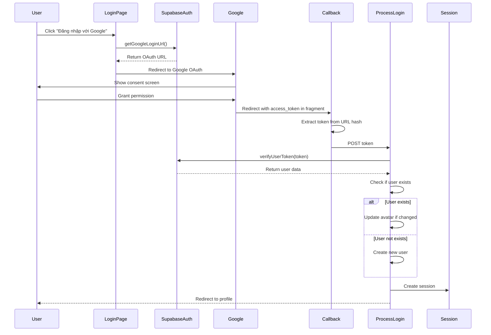

# Design Document: Google OAuth Login

## Overview

Tính năng Google OAuth Login cho phép người dùng đăng nhập vào hệ thống bằng tài khoản Google thông qua Supabase Auth API. Hệ thống sử dụng OAuth 2.0 flow với Supabase làm trung gian xác thực, giúp đơn giản hóa quá trình tích hợp và bảo mật.

### Key Features
- Đăng nhập nhanh chóng bằng tài khoản Google
- Tự động tạo tài khoản mới cho người dùng lần đầu
- Tích hợp với hệ thống session hiện tại
- Xử lý lỗi và edge cases toàn diện

### Technology Stack
- **Backend**: PHP 7.4+
- **Authentication Provider**: Supabase Auth API
- **JWT Library**: Firebase JWT (firebase/php-jwt)
- **Frontend**: Vanilla JavaScript
- **Session Management**: App\Core\Session

## Architecture

### High-Level Flow



### Component Architecture

```
┌─────────────────────────────────────────────────────────────┐
│                        Presentation Layer                    │
│  ┌──────────────┐  ┌──────────────┐  ┌──────────────┐      │
│  │  login.php   │  │ callback.php │  │process_login │      │
│  │              │  │              │  │    .php      │      │
│  └──────────────┘  └──────────────┘  └──────────────┘      │
└─────────────────────────────────────────────────────────────┘
                            │
                            ▼
┌─────────────────────────────────────────────────────────────┐
│                        Service Layer                         │
│  ┌──────────────────────────────────────────────────────┐   │
│  │         SupabaseAuthService                          │   │
│  │  ┌────────────────┐  ┌────────────────────────┐     │   │
│  │  │getGoogleLogin  │  │  verifyUserToken()     │     │   │
│  │  │    Url()       │  │                        │     │   │
│  │  └────────────────┘  └────────────────────────┘     │   │
│  └──────────────────────────────────────────────────────┘   │
└─────────────────────────────────────────────────────────────┘
                            │
                            ▼
┌─────────────────────────────────────────────────────────────┐
│                      External Services                       │
│  ┌──────────────┐  ┌──────────────┐  ┌──────────────┐      │
│  │  Supabase    │  │    Google    │  │   Firebase   │      │
│  │   Auth API   │  │     OAuth    │  │   JWT Lib    │      │
│  └──────────────┘  └──────────────┘  └──────────────┘      │
└─────────────────────────────────────────────────────────────┘
                            │
                            ▼
┌─────────────────────────────────────────────────────────────┐
│                         Data Layer                           │
│  ┌──────────────┐  ┌──────────────┐                         │
│  │  KhachHang   │  │   Session    │                         │
│  │    Model     │  │   Manager    │                         │
│  └──────────────┘  └──────────────┘                         │
└─────────────────────────────────────────────────────────────┘
```

## Components and Interfaces

### 1. SupabaseAuthService

Service class xử lý tương tác với Supabase Auth API.

**Location**: `app/services/supabase/SupabaseService.php`

**Methods**:

```php
class SupabaseAuthService
{
    /**
     * Tạo URL chuyển hướng đến Google OAuth
     * 
     * @return string OAuth authorization URL
     */
    public static function getGoogleLoginUrl(): string
    
    /**
     * Giải mã và xác thực JWT token từ Supabase
     * 
     * @param string $jwtToken Access token từ Supabase
     * @return object|null User data object hoặc null nếu invalid
     */
    public static function verifyUserToken(string $jwtToken): ?object
}
```

**Dependencies**:
- `Firebase\JWT\JWT` - JWT decoding
- `Firebase\JWT\Key` - JWT key handling
- `EnvSetup::env()` - Environment configuration

**Environment Variables**:
- `SUPABASE_URL` - Base URL của Supabase project
- `SUPABASE_JWT_SECRET` - Secret key để verify JWT
- `APP_URL` - Base URL của ứng dụng

### 2. Login Page Integration

**Location**: `app/views/client/auth/login.php`

**Changes Required**:
- Thêm nút "Đăng nhập với Google" sau form đăng nhập
- Sử dụng `SupabaseAuthService::getGoogleLoginUrl()` để tạo href
- Styling phù hợp với thiết kế hiện tại

**UI Mockup**:
```html
<!-- Existing login form -->
<form method="POST" action="/client/auth/login">
    <!-- ... existing fields ... -->
</form>

<!-- Divider -->
<div class="divider-text">
    <span>Hoặc đăng nhập với</span>
</div>

<!-- Google OAuth Button -->
<a href="<?= SupabaseAuthService::getGoogleLoginUrl() ?>" 
   class="btn btn-outline-secondary btn-lg w-100">
    
    Đăng nhập với Google
</a>
```

### 3. Callback Handler

**Location**: `app/views/client/auth/callback.php`

**Purpose**: Nhận access token từ URL fragment và chuyển đến process_login.php

**Implementation**:

```php
<!DOCTYPE html>
<html lang="vi">
<head>
    <meta charset="UTF-8">
    <title>Đang xử lý đăng nhập...</title>
    <style>
        body {
            display: flex;
            justify-content: center;
            align-items: center;
            min-height: 100vh;
            font-family: Arial, sans-serif;
            background-color: #f8f9fa;
        }
        .loader {
            text-align: center;
        }
        .spinner {
            border: 4px solid #f3f3f3;
            border-top: 4px solid #cb1c22;
            border-radius: 50%;
            width: 40px;
            height: 40px;
            animation: spin 1s linear infinite;
            margin: 0 auto 20px;
        }
        @keyframes spin {
            0% { transform: rotate(0deg); }
            100% { transform: rotate(360deg); }
        }
    </style>
</head>
<body>
    <div class="loader">
        <div class="spinner"></div>
        <p>Đang xử lý đăng nhập...</p>
    </div>

    <script>
        // Extract access_token from URL fragment
        const hash = window.location.hash.substring(1);
        const params = new URLSearchParams(hash);
        const accessToken = params.get('access_token');
        const error = params.get('error');
        const errorDescription = params.get('error_description');

        if (error) {
            // Handle OAuth error
            console.error('OAuth Error:', error, errorDescription);
            window.location.href = '/client/auth/login?error=oauth_failed&message=' + 
                encodeURIComponent(errorDescription || 'Đăng nhập thất bại');
        } else if (accessToken) {
            // Send token to backend for processing
            fetch('/app/views/client/auth/process_login.php', {
                method: 'POST',
                headers: {
                    'Content-Type': 'application/json'
                },
                body: JSON.stringify({ access_token: accessToken })
            })
            .then(response => response.json())
            .then(data => {
                if (data.success) {
                    window.location.href = data.redirect || '/client/profile';
                } else {
                    window.location.href = '/client/auth/login?error=' + 
                        encodeURIComponent(data.error || 'login_failed');
                }
            })
            .catch(error => {
                console.error('Error:', error);
                window.location.href = '/client/auth/login?error=network_error';
            });
        } else {
            // No token found
            window.location.href = '/client/auth/login?error=no_token';
        }
    </script>
</body>
</html>
```

**Key Features**:
- Extracts token from URL fragment using JavaScript
- Shows loading indicator during processing
- Handles OAuth errors from Supabase
- Sends token to backend via POST request
- Redirects based on response

### 4. Process Login Handler

**Location**: `app/views/client/auth/process_login.php`

**Purpose**: Xác thực token, tạo/cập nhật user, và tạo session

**Implementation**:

```php
<?php

require_once __DIR__ . '/../../../core/Session.php';
require_once __DIR__ . '/../../../services/supabase/SupabaseService.php';
require_once __DIR__ . '/../../../models/roles/KhachHang.php';

use App\Core\Session;

// Only accept POST requests
if ($_SERVER['REQUEST_METHOD'] !== 'POST') {
    http_response_code(405);
    echo json_encode(['success' => false, 'error' => 'method_not_allowed']);
    exit;
}

// Get JSON input
$input = file_get_contents('php://input');
$data = json_decode($input, true);

if (!isset($data['access_token'])) {
    echo json_encode(['success' => false, 'error' => 'missing_token']);
    exit;
}

$accessToken = $data['access_token'];

// Verify token with Supabase
$userData = SupabaseAuthService::verifyUserToken($accessToken);

if ($userData === null) {
    echo json_encode(['success' => false, 'error' => 'invalid_token']);
    exit;
}

// Extract user information from token
$supabaseId = $userData->sub ?? null; // UUID from Supabase
$email = $userData->email ?? null;
$name = $userData->user_metadata->full_name ?? $userData->user_metadata->name ?? 'User';
$avatarUrl = $userData->user_metadata->avatar_url ?? $userData->user_metadata->picture ?? null;

if (!$supabaseId || !$email) {
    echo json_encode(['success' => false, 'error' => 'missing_user_data']);
    exit;
}

$khachHang = new KhachHang();

// Step 1: Tìm user theo supabase_id
$existingUser = $khachHang->query("SELECT * FROM nguoi_dung WHERE supabase_id = '" . addslashes($supabaseId) . "' LIMIT 1");

if (!empty($existingUser)) {
    // User đã từng đăng nhập Google -> Cập nhật avatar nếu cần
    $userId = $existingUser[0]['id'];
    
    if ($avatarUrl && $avatarUrl !== $existingUser[0]['avatar_url']) {
        $khachHang->update($userId, [
            'avatar_url' => $avatarUrl,
            'ngay_cap_nhat' => date('Y-m-d H:i:s')
        ]);
    }
    
    $khachHang->setId($userId);
    $khachHang->setEmail($existingUser[0]['email']);
    $khachHang->setHoTen($existingUser[0]['ho_ten']);
    $khachHang->setAvatarUrl($avatarUrl ?? $existingUser[0]['avatar_url']);
    $khachHang->setLoaiTaiKhoan($existingUser[0]['loai_tai_khoan']);
} else {
    // Step 2: Không tìm thấy supabase_id -> Tìm theo email
    $existingUser = $khachHang->query("SELECT * FROM nguoi_dung WHERE email = '" . addslashes($email) . "' LIMIT 1");
    
    if (!empty($existingUser)) {
        // User đã có tài khoản LOCAL -> Liên kết với Google
        $userId = $existingUser[0]['id'];
        
        $khachHang->update($userId, [
            'supabase_id' => $supabaseId,
            'auth_provider' => 'GOOGLE',
            'avatar_url' => $avatarUrl ?? $existingUser[0]['avatar_url'],
            'ngay_cap_nhat' => date('Y-m-d H:i:s')
        ]);
        
        $khachHang->setId($userId);
        $khachHang->setEmail($existingUser[0]['email']);
        $khachHang->setHoTen($existingUser[0]['ho_ten']);
        $khachHang->setAvatarUrl($avatarUrl ?? $existingUser[0]['avatar_url']);
        $khachHang->setLoaiTaiKhoan($existingUser[0]['loai_tai_khoan']);
    } else {
        // Step 3: User hoàn toàn mới -> Tạo tài khoản mới
        $now = date('Y-m-d H:i:s');
        $newUserId = $khachHang->create([
            'supabase_id' => $supabaseId,
            'auth_provider' => 'GOOGLE',
            'email' => $email,
            'ho_ten' => $name,
            'avatar_url' => $avatarUrl,
            'mat_khau' => null, // NULL for OAuth users
            'loai_tai_khoan' => 'MEMBER',
            'trang_thai' => 'ACTIVE', // Google OAuth users are pre-verified
            'ngay_tao' => $now,
            'ngay_cap_nhat' => $now
        ]);
        
        if (!$newUserId) {
            echo json_encode(['success' => false, 'error' => 'create_user_failed']);
            exit;
        }
        
        $khachHang->setId($newUserId);
        $khachHang->setEmail($email);
        $khachHang->setHoTen($name);
        $khachHang->setAvatarUrl($avatarUrl);
        $khachHang->setLoaiTaiKhoan('MEMBER');
    }
}

// Create session
Session::start();
Session::login([
    'id' => $khachHang->getId(),
    'email' => $khachHang->getEmail(),
    'ho_ten' => $khachHang->getHoTen(),
    'loai_tai_khoan' => $khachHang->getLoaiTaiKhoan(),
    'avatar_url' => $khachHang->getAvatarUrl()
]);

// Return success response
echo json_encode([
    'success' => true,
    'redirect' => '/client/profile'
]);
```

**Key Features**:
- Validates POST request and JSON input
- Verifies JWT token with SupabaseAuthService
- Extracts supabase_id (sub) from token
- **Step 1**: Tìm user theo supabase_id
- **Step 2**: Nếu không có, tìm theo email và liên kết tài khoản
- **Step 3**: Nếu không có cả hai, tạo user mới
- Creates session using existing Session class
- Returns JSON response for frontend

## Data Models

### User Data from Google OAuth

Token payload structure từ Supabase:

```json
{
  "aud": "authenticated",
  "exp": 1234567890,
  "sub": "a1b2c3d4-e5f6-7890-abcd-ef1234567890", // UUID - Supabase ID
  "email": "user@example.com",
  "phone": "",
  "app_metadata": {
    "provider": "google",
    "providers": ["google"]
  },
  "user_metadata": {
    "avatar_url": "https://lh3.googleusercontent.com/...",
    "email": "user@example.com",
    "email_verified": true,
    "full_name": "John Doe",
    "iss": "https://accounts.google.com",
    "name": "John Doe",
    "picture": "https://lh3.googleusercontent.com/...",
    "provider_id": "1234567890",
    "sub": "1234567890"
  },
  "role": "authenticated"
}
```

**Important Fields**:
- `sub` (root level): UUID từ Supabase - lưu vào trường `supabase_id`
- `email`: Email người dùng
- `user_metadata.full_name` hoặc `user_metadata.name`: Tên người dùng
- `user_metadata.avatar_url` hoặc `user_metadata.picture`: Avatar URL

### Database Schema

Bảng `nguoi_dung` đã tồn tại với các trường:

```sql
CREATE TABLE nguoi_dung (
    id INT PRIMARY KEY AUTO_INCREMENT,
    supabase_id CHAR(36) DEFAULT NULL COMMENT 'Mã định danh duy nhất từ Supabase',
    auth_provider ENUM('LOCAL', 'GOOGLE', 'FACEBOOK') DEFAULT 'LOCAL' COMMENT 'Nguồn tạo tài khoản',
    email VARCHAR(255) UNIQUE NOT NULL,
    mat_khau VARCHAR(255) DEFAULT NULL COMMENT 'Cho phép NULL nếu đăng nhập bằng nền tảng khác',
    ho_ten VARCHAR(255),
    sdt VARCHAR(20),
    avatar_url TEXT,
    ngay_sinh DATE,
    gioi_tinh ENUM('NAM', 'NU', 'KHAC'),
    loai_tai_khoan ENUM('ADMIN', 'MEMBER') DEFAULT 'MEMBER',
    trang_thai ENUM('ACTIVE', 'BLOCKED', 'UNVERIFIED') DEFAULT 'ACTIVE',
    verification_token VARCHAR(255),
    forget_token VARCHAR(255),
    ngay_tao DATETIME,
    ngay_cap_nhat DATETIME,
    UNIQUE KEY idx_supabase_id (supabase_id),
    UNIQUE KEY idx_email (email)
);
```

**Migration SQL** (để cập nhật bảng hiện tại):

```sql
ALTER TABLE `nguoi_dung`
-- 1. Cho phép mật khẩu được NULL
MODIFY `mat_khau` VARCHAR(255) CHARACTER SET utf8mb4 COLLATE utf8mb4_unicode_ci DEFAULT NULL COMMENT 'Cho phép NULL nếu đăng nhập bằng nền tảng khác',

-- 2. Thêm cột lưu UUID của Supabase (UUID có độ dài 36 ký tự)
ADD `supabase_id` CHAR(36) COLLATE utf8mb4_unicode_ci DEFAULT NULL COMMENT 'Mã định danh duy nhất từ Supabase' AFTER `id`,

-- 3. Thêm cột phân loại nguồn đăng nhập
ADD `auth_provider` ENUM('LOCAL','GOOGLE','FACEBOOK') COLLATE utf8mb4_unicode_ci DEFAULT 'LOCAL' COMMENT 'Nguồn tạo tài khoản' AFTER `supabase_id`,

-- 4. Đánh Index cho supabase_id và email để tăng tốc độ truy vấn khi đăng nhập
ADD UNIQUE KEY `idx_supabase_id` (`supabase_id`),
ADD UNIQUE KEY `idx_email` (`email`);
```

**Notes**:
- `mat_khau` có thể NULL cho users đăng nhập qua OAuth
- `supabase_id` lưu UUID từ Supabase (trường `sub` trong JWT token)
- `auth_provider` phân biệt nguồn tạo tài khoản (LOCAL, GOOGLE, FACEBOOK)
- `trang_thai` được set là 'ACTIVE' ngay lập tức cho OAuth users (đã verify qua provider)
- `verification_token` không cần thiết cho OAuth users

### Session Data Structure

Session data format (tương thích với hệ thống hiện tại):

```php
[
    'user_id' => 123,
    'user_email' => 'user@example.com',
    'user_name' => 'John Doe',
    'user_role' => 'MEMBER',
    'user_avatar' => 'https://lh3.googleusercontent.com/...',
    'last_activity' => 1234567890
]
```

## Error Handling

### Error Types and Responses

| Error Type | Trigger | Response | User Message |
|------------|---------|----------|--------------|
| `oauth_failed` | User denies permission | Redirect to login | "Bạn đã từ chối cấp quyền" |
| `no_token` | No token in URL fragment | Redirect to login | "Đăng nhập thất bại, vui lòng thử lại" |
| `invalid_token` | Token verification fails | Redirect to login | "Phiên đăng nhập không hợp lệ" |
| `missing_email` | No email in token | Redirect to login | "Không thể lấy thông tin email" |
| `create_user_failed` | Database insert fails | Redirect to login | "Không thể tạo tài khoản" |
| `network_error` | Fetch request fails | Redirect to login | "Lỗi kết nối, vui lòng thử lại" |
| `method_not_allowed` | Non-POST request | HTTP 405 | N/A (API error) |

### Error Logging

Tất cả errors được log vào PHP error_log:

```php
error_log("Google OAuth Error: " . $errorType . " - " . $errorMessage);
```

### Error Display

Errors được hiển thị trên login page thông qua query parameters:

```php
<?php if (isset($_GET['error'])): ?>
    <div class="alert alert-danger">
        <?php
        $errorMessages = [
            'oauth_failed' => 'Bạn đã từ chối cấp quyền đăng nhập',
            'no_token' => 'Đăng nhập thất bại, vui lòng thử lại',
            'invalid_token' => 'Phiên đăng nhập không hợp lệ',
            'missing_email' => 'Không thể lấy thông tin email từ Google',
            'create_user_failed' => 'Không thể tạo tài khoản, vui lòng thử lại',
            'network_error' => 'Lỗi kết nối, vui lòng kiểm tra internet'
        ];
        echo $errorMessages[$_GET['error']] ?? 'Đã có lỗi xảy ra';
        ?>
    </div>
<?php endif; ?>
```

## Testing Strategy

### Why Property-Based Testing is NOT Applicable

Tính năng Google OAuth Login là một **integration feature** với external services (Supabase, Google OAuth). Property-based testing không phù hợp vì:

1. **External Service Behavior**: Hầu hết logic phụ thuộc vào Supabase và Google OAuth API, không phải code của chúng ta
2. **Infrastructure Wiring**: Testing chủ yếu về việc các services được kết nối đúng cách
3. **Non-deterministic Responses**: OAuth tokens và responses thay đổi mỗi lần, không có "universal properties"
4. **High Cost**: Gọi real OAuth APIs 100+ lần không practical và tốn kém
5. **One-time Setup**: Nhiều aspects là configuration checks (environment variables, callback URLs)

### Testing Approach

Thay vì property-based testing, chúng ta sử dụng:

#### 1. Unit Tests (với Mocks)

Test các methods riêng lẻ với mocked dependencies:

**SupabaseAuthService Tests**:
```php
class SupabaseAuthServiceTest extends TestCase
{
    public function testGetGoogleLoginUrlReturnsCorrectFormat()
    {
        $url = SupabaseAuthService::getGoogleLoginUrl();
        
        $this->assertStringContainsString('/auth/v1/authorize', $url);
        $this->assertStringContainsString('provider=google', $url);
        $this->assertStringContainsString('redirect_to=', $url);
    }
    
    public function testVerifyUserTokenWithValidToken()
    {
        $mockToken = $this->createMockJWT([
            'email' => 'test@example.com',
            'user_metadata' => [
                'full_name' => 'Test User',
                'avatar_url' => 'https://example.com/avatar.jpg'
            ]
        ]);
        
        $result = SupabaseAuthService::verifyUserToken($mockToken);
        
        $this->assertNotNull($result);
        $this->assertEquals('test@example.com', $result->email);
    }
    
    public function testVerifyUserTokenWithInvalidToken()
    {
        $result = SupabaseAuthService::verifyUserToken('invalid_token');
        
        $this->assertNull($result);
    }
    
    public function testVerifyUserTokenWithExpiredToken()
    {
        $expiredToken = $this->createMockJWT([
            'email' => 'test@example.com',
            'exp' => time() - 3600 // Expired 1 hour ago
        ]);
        
        $result = SupabaseAuthService::verifyUserToken($expiredToken);
        
        $this->assertNull($result);
    }
}
```

**Process Login Tests** (với mocked database):
```php
class ProcessLoginTest extends TestCase
{
    public function testCreatesNewUserWhenEmailNotExists()
    {
        // Mock database to return empty result
        // Mock SupabaseAuthService to return valid user data
        // Assert new user is created with correct data
    }
    
    public function testUpdatesAvatarWhenUserExists()
    {
        // Mock database to return existing user
        // Mock SupabaseAuthService with different avatar
        // Assert avatar is updated
    }
    
    public function testCreatesSessionAfterSuccessfulLogin()
    {
        // Mock successful token verification
        // Assert Session::login() is called with correct data
    }
}
```

#### 2. Integration Tests

Test end-to-end flow với test Supabase project:

```php
class GoogleOAuthIntegrationTest extends TestCase
{
    public function testCompleteOAuthFlow()
    {
        // 1. Get OAuth URL
        $url = SupabaseAuthService::getGoogleLoginUrl();
        $this->assertNotEmpty($url);
        
        // 2. Simulate OAuth callback with test token
        $testToken = $this->getTestTokenFromSupabase();
        
        // 3. Verify token
        $userData = SupabaseAuthService::verifyUserToken($testToken);
        $this->assertNotNull($userData);
        $this->assertNotEmpty($userData->email);
        
        // 4. Test user creation/update
        // 5. Test session creation
    }
}
```

#### 3. Manual Testing Checklist

- [ ] Click "Đăng nhập với Google" redirects to Google OAuth
- [ ] Grant permission creates new user successfully
- [ ] Deny permission shows appropriate error message
- [ ] Existing user login updates avatar if changed
- [ ] Session is created correctly after login
- [ ] User is redirected to profile page
- [ ] Logout clears OAuth session
- [ ] Invalid/expired tokens show error messages
- [ ] Network errors are handled gracefully

#### 4. Security Testing

- [ ] JWT signature is validated correctly
- [ ] Expired tokens are rejected
- [ ] Invalid tokens are rejected
- [ ] SUPABASE_JWT_SECRET is not exposed in logs
- [ ] Access tokens are not stored in database
- [ ] Callback URL is whitelisted in Supabase
- [ ] HTTPS is enforced in production

#### 5. Environment Configuration Tests

```php
class EnvironmentConfigTest extends TestCase
{
    public function testRequiredEnvironmentVariablesExist()
    {
        $envConfig = EnvSetup::env(dirname(__DIR__, 3));
        
        $this->assertNotEmpty($envConfig('SUPABASE_URL'));
        $this->assertNotEmpty($envConfig('SUPABASE_JWT_SECRET'));
        $this->assertNotEmpty($envConfig('APP_URL'));
    }
    
    public function testSupabaseUrlFormat()
    {
        $envConfig = EnvSetup::env(dirname(__DIR__, 3));
        $url = $envConfig('SUPABASE_URL');
        
        $this->assertStringStartsWith('https://', $url);
        $this->assertStringContainsString('.supabase.co', $url);
    }
}
```

### Test Coverage Goals

- **Unit Tests**: 80%+ coverage cho SupabaseAuthService
- **Integration Tests**: Cover happy path và major error scenarios
- **Manual Tests**: Complete checklist trước khi deploy
- **Security Tests**: All security requirements validated

### Continuous Testing

- Run unit tests on every commit
- Run integration tests before merge to main
- Manual testing on staging environment
- Security audit before production deployment

