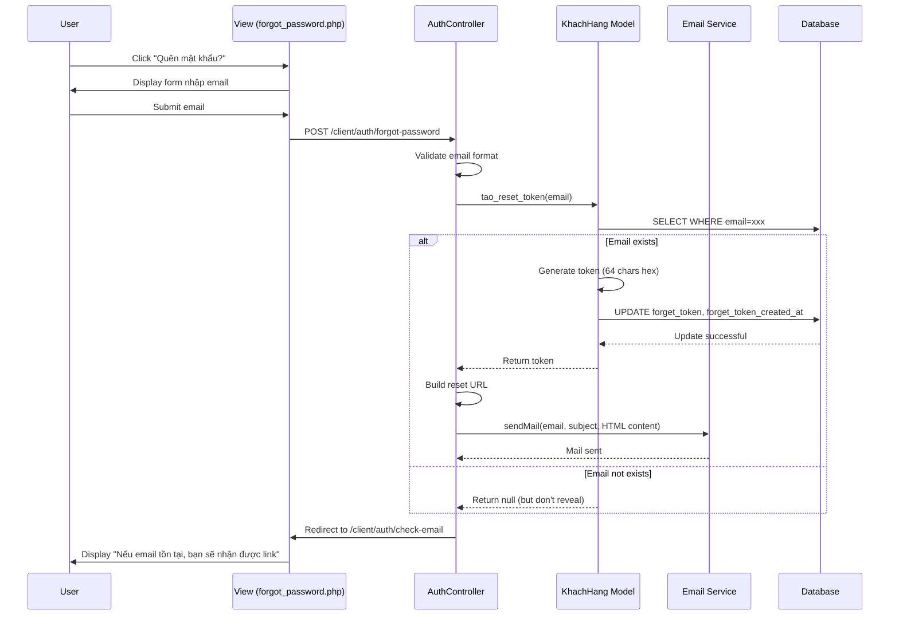
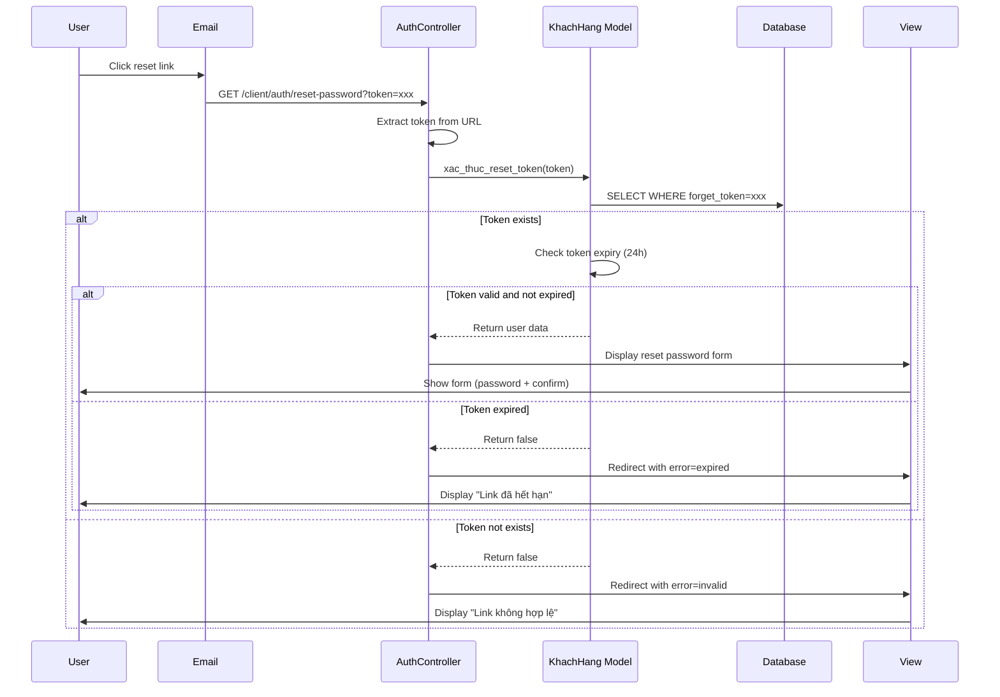
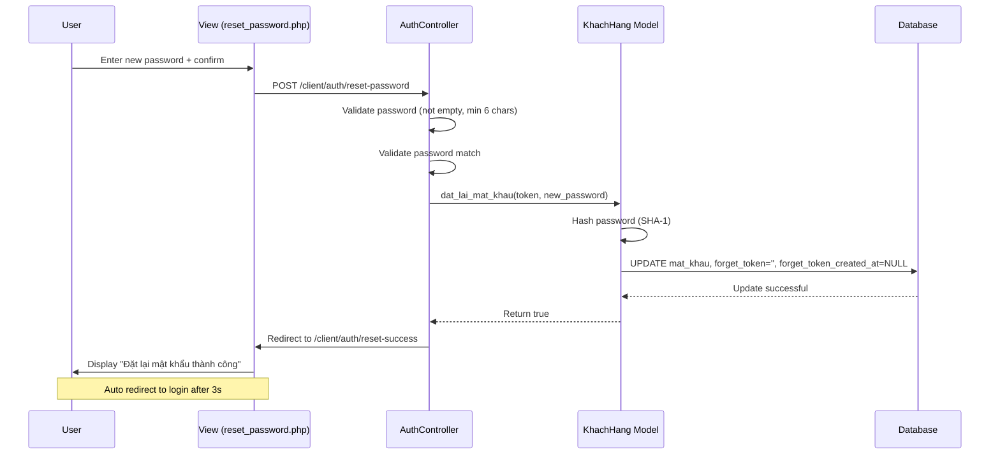

# Tài liệu Thiết kế - Chức năng Quên Mật khẩu

## Overview

Chức năng quên mật khẩu cho phép người dùng đặt lại mật khẩu khi không thể đăng nhập vào tài khoản. Hệ thống sẽ gửi email chứa link đặt lại mật khẩu có thời hạn 24 giờ, đảm bảo tính bảo mật và trải nghiệm người dùng mượt mà.

### Mục tiêu thiết kế

- Đảm bảo tính bảo mật: chỉ người có quyền truy cập email mới có thể đặt lại mật khẩu
- Ngăn chặn information disclosure về việc email có tồn tại hay không
- Token có thời hạn 24 giờ để giảm thiểu rủi ro bảo mật
- Token chỉ sử dụng một lần và tự động vô hiệu hóa sau khi đặt lại mật khẩu thành công
- Xử lý các trường hợp lỗi một cách rõ ràng và an toàn

### Phạm vi

Tính năng này bao gồm:
- Hiển thị link "Quên mật khẩu?" trên trang đăng nhập
- Form yêu cầu đặt lại mật khẩu (nhập email)
- Sinh và lưu trữ reset token với timestamp
- Gửi email chứa link đặt lại mật khẩu
- Xác thực reset token và kiểm tra thời hạn
- Form nhập mật khẩu mới
- Cập nhật mật khẩu và vô hiệu hóa token
- Cập nhật database schema (thêm 2 cột mới)

## Architecture

### Tổng quan kiến trúc

Hệ thống password reset được xây dựng theo mô hình MVC với các thành phần chính:

```
┌─────────────────┐
│   Client/User   │
└────────┬────────┘
         │
         ▼
┌─────────────────────────────────────────────────────────────────┐
│                    Presentation Layer                            │
│  ┌──────────────┐  ┌──────────────┐  ┌──────────────────────┐  │
│  │  login.php   │  │forgot_pass   │  │ reset_password.php   │  │
│  │              │  │  word.php    │  │                      │  │
│  └──────────────┘  └──────────────┘  └──────────────────────┘  │
│  ┌──────────────┐  ┌──────────────┐                             │
│  │check_email   │  │reset_success │                             │
│  │  .php        │  │  .php        │                             │
│  └──────────────┘  └──────────────┘                             │
└────────┬────────────────────────────────────────────────────────┘
         │
         ▼
┌─────────────────────────────────────────────────────────────────┐
│                   Controller Layer                               │
│              ┌──────────────────────────────┐                    │
│              │   AuthController             │                    │
│              │  - requestPasswordReset()    │                    │
│              │  - verifyResetToken()        │                    │
│              │  - resetPassword()           │                    │
│              └──────────┬───────────────────┘                    │
└─────────────────────────┼───────────────────────────────────────┘
                          │
         ┌────────────────┼────────────────┐
         ▼                ▼                ▼
┌────────────────┐ ┌─────────────┐ ┌──────────────┐
│  KhachHang     │ │   Session   │ │ Email Service│
│  Model         │ │   Manager   │ │ (PHPMailer)  │
│  - tao_reset_  │ │  - set()    │ │ - sendMail() │
│    token()     │ │  - get()    │ └──────────────┘
│  - xac_thuc_   │ └─────────────┘
│    reset_token()│
│  - dat_lai_    │
│    mat_khau()  │
└────────┬───────┘
         │
         ▼
┌─────────────────────────────────────────────────────────────────┐
│                    Database Layer                                │
│                  ┌──────────────────────────┐                    │
│                  │  nguoi_dung              │                    │
│                  │  - id                    │                    │
│                  │  - email                 │                    │
│                  │  - mat_khau              │                    │
│                  │  - forget_token (NEW)    │                    │
│                  │  - forget_token_created_ │                    │
│                  │    at (NEW)              │                    │
│                  └──────────────────────────┘                    │
└─────────────────────────────────────────────────────────────────┘
```

### Luồng xử lý chính

#### 1. Luồng yêu cầu đặt lại mật khẩu (Request Password Reset Flow)



#### 2. Luồng xác thực link đặt lại mật khẩu (Verify Reset Link Flow)



#### 3. Luồng đặt lại mật khẩu (Reset Password Flow)



### Các thành phần chính

#### AuthController
- Xử lý logic yêu cầu đặt lại mật khẩu, xác thực token, đặt lại mật khẩu
- Validate input từ người dùng
- Điều phối giữa Model và Email Service
- Xử lý redirect và error handling
- Không tiết lộ thông tin email có tồn tại hay không

#### KhachHang Model
- Tương tác với database
- Thực hiện business logic: tạo reset token, xác thực token, đặt lại mật khẩu
- Sinh và quản lý reset token với timestamp
- Kiểm tra token expiry (24 giờ)
- Hash mật khẩu

#### Email Service (PHPMailer)
- Gửi email đặt lại mật khẩu
- Sử dụng SMTP Gmail
- Hỗ trợ HTML email template

## Components and Interfaces

### 1. AuthController (Extended)

```php
namespace App\Controllers\Client;

class AuthController
{
    /**
     * Xử lý yêu cầu đặt lại mật khẩu
     * 
     * @param string $email Email người dùng
     * @return void Redirect to check-email page
     */
    public static function requestPasswordReset(string $email): void;

    /**
     * Hiển thị form đặt lại mật khẩu sau khi xác thực token
     * 
     * @param string $token Reset token từ URL
     * @return void Display form or redirect with error
     */
    public static function verifyResetToken(string $token): void;

    /**
     * Xử lý đặt lại mật khẩu
     * 
     * @param string $token Reset token
     * @param string $newPassword Mật khẩu mới
     * @param string $confirmPassword Xác nhận mật khẩu
     * @return void Redirect to success or error page
     */
    public static function resetPassword(string $token, string $newPassword, string $confirmPassword): void;
}
```

### 2. KhachHang Model (Extended)

```php
class KhachHang extends NguoiDung
{
    /**
     * Tạo reset token và lưu vào database
     * 
     * @param string $email Email người dùng
     * @return string|null Reset token hoặc null nếu email không tồn tại
     */
    public function tao_reset_token(string $email): ?string;

    /**
     * Xác thực reset token và kiểm tra thời hạn
     * 
     * @param string $token Reset token
     * @return array|null User data nếu token hợp lệ, null nếu không
     */
    public function xac_thuc_reset_token(string $token): ?array;

    /**
     * Đặt lại mật khẩu và vô hiệu hóa token
     * 
     * @param string $token Reset token
     * @param string $matKhauMoi Mật khẩu mới
     * @return bool True nếu thành công
     */
    public function dat_lai_mat_khau(string $token, string $matKhauMoi): bool;
}
```

### 3. Routes (New)

```php
// Trang quên mật khẩu (form nhập email)
GET /client/auth/forgot-password
  - Output: HTML form

// Xử lý yêu cầu đặt lại mật khẩu
POST /client/auth/forgot-password
  - Input: email
  - Output: Redirect to /client/auth/check-email

// Trang thông báo kiểm tra email
GET /client/auth/check-email
  - Output: HTML page với thông báo

// Xác thực reset token và hiển thị form đặt lại mật khẩu
GET /client/auth/reset-password?token={token}
  - Input: token (query parameter)
  - Output: HTML form hoặc redirect with error

// Xử lý đặt lại mật khẩu
POST /client/auth/reset-password
  - Input: token, new_password, confirm_password
  - Output: Redirect to /client/auth/reset-success hoặc error

// Trang đặt lại mật khẩu thành công
GET /client/auth/reset-success
  - Output: HTML page với thông báo thành công
```

## Data Models

### Database Schema Changes

Cần thêm 2 cột mới vào bảng `nguoi_dung`:

```sql
ALTER TABLE `nguoi_dung`
ADD COLUMN `forget_token` VARCHAR(64) NULL DEFAULT NULL COMMENT 'Token đặt lại mật khẩu',
ADD COLUMN `forget_token_created_at` DATETIME NULL DEFAULT NULL COMMENT 'Thời gian tạo token',
ADD INDEX `idx_forget_token` (`forget_token`);
```

### Entity: nguoi_dung (Updated)

| Cột | Kiểu dữ liệu | Mô tả | Ràng buộc |
|-----|-------------|-------|-----------|
| forget_token | VARCHAR(64) | Token đặt lại mật khẩu | NULL, INDEX |
| forget_token_created_at | DATETIME | Thời gian tạo token | NULL |

### Reset Token

- Độ dài: 64 ký tự hexadecimal
- Sinh bằng: `bin2hex(random_bytes(32))`
- Duy nhất cho mỗi yêu cầu
- Được xóa (set về NULL) sau khi đặt lại mật khẩu thành công
- Thời gian hết hạn: 24 giờ (kiểm tra bằng forget_token_created_at)

### Data Flow

#### 1. Khi yêu cầu đặt lại mật khẩu

```
Input: {email}
↓
Validate email format
↓
SELECT * FROM nguoi_dung WHERE email = user_email
↓
If found:
  Generate token = bin2hex(random_bytes(32))
  ↓
  UPDATE nguoi_dung SET
    forget_token = generated_token,
    forget_token_created_at = NOW()
  WHERE email = user_email
  ↓
  Return token
Else:
  Return null (but don't reveal to user)
↓
Send email with reset link (if token exists)
↓
Redirect to check-email page
```

#### 2. Khi xác thực reset token

```
Input: {token}
↓
Escape token (SQL injection prevention)
↓
SELECT * FROM nguoi_dung 
WHERE forget_token = token
↓
If found:
  Calculate time_diff = NOW() - forget_token_created_at
  ↓
  If time_diff <= 24 hours:
    Return user data
  Else:
    Return false (expired)
Else:
  Return false (invalid)
```

#### 3. Khi đặt lại mật khẩu

```
Input: {token, new_password}
↓
Validate password (not empty, min 6 chars)
↓
Hash password = sha1(new_password)
↓
UPDATE nguoi_dung SET
  mat_khau = hashed_password,
  forget_token = NULL,
  forget_token_created_at = NULL,
  ngay_cap_nhat = NOW()
WHERE forget_token = token
↓
Return success
```

### Indexes

Các index cần thiết để tối ưu performance:

```sql
-- Index cho forget_token lookup
CREATE INDEX idx_forget_token ON nguoi_dung(forget_token);
```


## Correctness Properties

*A property is a characteristic or behavior that should hold true across all valid executions of a system-essentially, a formal statement about what the system should do. Properties serve as the bridge between human-readable specifications and machine-verifiable correctness guarantees.*

### Property Reflection

Sau khi phân tích acceptance criteria, tôi đã xác định các properties có thể gộp lại:

**Redundancy Analysis:**

1. **Properties 2.6 và 2.7** có thể gộp thành một property: "Token và timestamp được lưu cùng nhau"
2. **Properties 4.11 và 4.12** có thể gộp thành một property: "Token và timestamp được xóa cùng nhau sau reset"
3. **Properties 2.4 và 2.10** cùng validate security requirement về không tiết lộ thông tin email - có thể gộp với 7.1
4. **Properties 6.3 và 6.4** cùng về reset link trong email - có thể gộp thành một property về email content
5. **Properties 4.3 và 4.4** cùng validate empty password - có thể gộp
6. **Properties 4.5 và 4.6** cùng validate password length - có thể gộp
7. **Properties 4.7 và 4.8** cùng validate password match - có thể gộp

Các properties sau khi gộp sẽ giảm từ ~40 xuống còn ~30 properties, loại bỏ redundancy và tăng tính rõ ràng.

### Property 1: Link "Quên mật khẩu?" hiển thị trên trang đăng nhập

*For any* login page render, the page SHALL contain a link with text "Quên mật khẩu?" that navigates to the forgot password page.

**Validates: Requirements 1.1, 1.2**

### Property 2: Form yêu cầu đặt lại mật khẩu có đầy đủ elements

*For any* forgot password page render, the page SHALL contain an email input field and a submit button labeled "Gửi link đặt lại mật khẩu".

**Validates: Requirements 1.3, 1.4**

### Property 3: Email format validation

*For any* email input submitted, the system SHALL validate the email format using standard email validation rules.

**Validates: Requirements 2.1**

### Property 4: Invalid email rejection

*For any* email that fails format validation, the system SHALL reject the request and display error message "Email không hợp lệ".

**Validates: Requirements 2.2**

### Property 5: Email existence check

*For any* valid email format submitted, the system SHALL query the database to check if the email exists.

**Validates: Requirements 2.3**

### Property 6: Token generation format

*For any* existing email in database, the system SHALL generate a reset token that is exactly 64 hexadecimal characters (matching regex pattern `^[0-9a-f]{64}$`).

**Validates: Requirements 2.5**

### Property 7: Token and timestamp persistence

*For any* generated reset token, both the token and the creation timestamp SHALL be persisted together in the database (forget_token and forget_token_created_at columns).

**Validates: Requirements 2.6, 2.7**

### Property 8: Reset link format

*For any* generated token, the reset link SHALL match the format `{base_url}/client/auth/reset-password?token={token}`.

**Validates: Requirements 2.8**

### Property 9: Email service invocation

*For any* successful token generation, the email service SHALL be invoked with the user's email address, subject, and HTML content containing the reset link.

**Validates: Requirements 2.9**

### Property 10: Consistent response message (security)

*For any* password reset request (regardless of whether email exists or not), the system SHALL display the same message "Nếu email tồn tại, bạn sẽ nhận được link đặt lại mật khẩu" to prevent email enumeration.

**Validates: Requirements 2.4, 2.10, 7.1**

### Property 11: Token extraction from URL

*For any* reset password URL accessed, the system SHALL extract the token parameter from the query string.

**Validates: Requirements 3.1**

### Property 12: Token existence validation

*For any* extracted token, the system SHALL query the database to verify the token exists in the forget_token column.

**Validates: Requirements 3.2**

### Property 13: Invalid token rejection

*For any* token that does not exist in the database, the system SHALL display error message "Link đặt lại mật khẩu không hợp lệ".

**Validates: Requirements 3.3**

### Property 14: Token expiry check

*For any* existing token, the system SHALL calculate the time difference between current time and forget_token_created_at, and reject if greater than 24 hours.

**Validates: Requirements 3.4, 3.5**

### Property 15: Valid token displays reset form

*For any* token that exists and is not expired, the system SHALL display a form with password and confirm password input fields.

**Validates: Requirements 3.6, 4.1, 4.2**

### Property 16: Password non-empty validation

*For any* password reset submission, if the new password is empty or contains only whitespace, the system SHALL reject with error "Vui lòng nhập mật khẩu mới".

**Validates: Requirements 4.3, 4.4**

### Property 17: Password minimum length validation

*For any* non-empty password submitted, if the length is less than 6 characters, the system SHALL reject with error "Mật khẩu phải có ít nhất 6 ký tự".

**Validates: Requirements 4.5, 4.6**

### Property 18: Password match validation

*For any* password reset submission, if the new password and confirm password do not match, the system SHALL reject with error "Mật khẩu xác nhận không khớp".

**Validates: Requirements 4.7, 4.8**

### Property 19: Password hashing with SHA-1

*For any* valid password submitted, the system SHALL hash the password using SHA-1 algorithm before storing in database.

**Validates: Requirements 4.9**

### Property 20: Password update in database

*For any* successfully hashed password, the system SHALL update the mat_khau column in the database with the hashed value.

**Validates: Requirements 4.10**

### Property 21: Token invalidation after use

*For any* successful password reset, both forget_token and forget_token_created_at SHALL be set to NULL in the database to prevent token reuse.

**Validates: Requirements 4.11, 4.12, 7.3**

### Property 22: Success message and redirect

*For any* successful password reset, the system SHALL display message "Đặt lại mật khẩu thành công" and automatically redirect to login page after 3 seconds.

**Validates: Requirements 4.13, 4.14**

### Property 23: Email HTML format and subject

*For any* password reset email sent, the email SHALL be in HTML format with subject line containing "Đặt lại mật khẩu" or similar.

**Validates: Requirements 6.1**

### Property 24: Email personalization

*For any* password reset email sent, the email content SHALL include the user's name (ho_ten field).

**Validates: Requirements 6.2**

### Property 25: Email reset link content

*For any* password reset email sent, the email SHALL contain both a clickable button labeled "Đặt lại mật khẩu" and a plain text fallback link.

**Validates: Requirements 6.3, 6.4**

### Property 26: Email expiry information

*For any* password reset email sent, the email content SHALL include information stating that the link expires after 24 hours.

**Validates: Requirements 6.5**

### Property 27: Email service error handling

*For any* email service failure, the system SHALL display error message "Không thể gửi email, vui lòng thử lại sau".

**Validates: Requirements 6.7**

### Property 28: Token replacement on multiple requests

*For any* user requesting password reset multiple times, each new request SHALL overwrite the previous forget_token and forget_token_created_at with new values.

**Validates: Requirements 7.2**

### Property 29: Cryptographically secure token generation

*For any* reset token generated, it SHALL be created using bin2hex(random_bytes(32)) to ensure cryptographic security.

**Validates: Requirements 7.4**

### Property 30: SQL injection prevention

*For any* token parameter received from user input, the token SHALL be escaped using mysqli_real_escape_string before being used in SQL queries.

**Validates: Requirements 7.5**

### Property 31: Expired token page has retry link

*For any* expired token error page displayed, the page SHALL contain a link labeled "Yêu cầu link mới" that navigates to the forgot password page.

**Validates: Requirements 7.6**


## Error Handling

### Validation Errors

| Error Code | Trigger Condition | User Message | Action |
|-----------|------------------|--------------|--------|
| invalid_email | Email không đúng định dạng | "Email không hợp lệ" | Redirect về form với error |
| empty_password | Password trống hoặc chỉ có whitespace | "Vui lòng nhập mật khẩu mới" | Display error on form |
| password_too_short | Password < 6 ký tự | "Mật khẩu phải có ít nhất 6 ký tự" | Display error on form |
| password_mismatch | Password và confirm password không khớp | "Mật khẩu xác nhận không khớp" | Display error on form |

### Token Errors

| Error Code | Trigger Condition | User Message | Action |
|-----------|------------------|--------------|--------|
| invalid_token | Token không tồn tại trong database | "Link đặt lại mật khẩu không hợp lệ" | Display error page |
| expired_token | Token đã quá 24 giờ | "Link đặt lại mật khẩu đã hết hạn" | Display error page với link request lại |
| empty_token | Token parameter trống hoặc missing | "Link đặt lại mật khẩu không hợp lệ" | Redirect về forgot password |

### System Errors

| Error Code | Trigger Condition | User Message | Action |
|-----------|------------------|--------------|--------|
| mail_failed | Email service không gửi được email | "Không thể gửi email, vui lòng thử lại sau" | Display error on form |
| database_error | Lỗi khi query/update database | "Có lỗi xảy ra, vui lòng thử lại sau" | Display generic error |
| update_failed | Không thể cập nhật mật khẩu | "Không thể đặt lại mật khẩu, vui lòng thử lại" | Display error on form |

### Error Handling Strategy

1. **Input Validation**: Validate tất cả input trước khi xử lý
   - Email format validation
   - Password requirements check (not empty, min 6 chars)
   - Password match validation
   - Token format validation

2. **Security-First Error Messages**: Không tiết lộ thông tin nhạy cảm
   - Không cho biết email có tồn tại hay không
   - Sử dụng generic message cho cả success và failure cases
   - Không tiết lộ chi tiết về token invalid

3. **Database Errors**: Catch và log database exceptions
   - Return generic error message cho user
   - Log chi tiết lỗi cho debugging
   - Rollback transactions nếu cần

4. **Email Service Errors**: Handle email sending failures gracefully
   - Display user-friendly error message
   - Log error details for debugging
   - Không block user flow

5. **Token Expiry Handling**: Provide clear guidance
   - Display expiry message
   - Provide link to request new token
   - Clear expired tokens periodically (background job)

6. **Logging**: Log tất cả errors và security events
   - Timestamp
   - Error type
   - User context (email, IP)
   - Stack trace (nếu có)
   - Security events (failed attempts, expired tokens)

### Error Response Format

Errors được truyền qua URL query parameter hoặc session:

```php
// URL parameter
/client/auth/forgot-password?error={error_code}
/client/auth/reset-password?token={token}&error={error_code}

// Session flash message
$_SESSION['error'] = 'error_message';
$_SESSION['success'] = 'success_message';
```

View sẽ check `$_GET['error']` hoặc `$_SESSION['error']` và hiển thị message tương ứng.

## Testing Strategy

### Dual Testing Approach

Tính năng password reset sẽ được test bằng cả unit tests và property-based tests:

- **Unit tests**: Verify specific examples, edge cases, và error conditions
- **Property tests**: Verify universal properties across all inputs
- Cả hai approaches đều cần thiết để đảm bảo comprehensive coverage

### Unit Testing

Unit tests sẽ focus vào:

1. **Specific Examples**
   - Request reset với email cụ thể hợp lệ
   - Verify token với token cụ thể hợp lệ
   - Reset password với password cụ thể hợp lệ
   - Test với email không tồn tại

2. **Edge Cases**
   - Empty token
   - Token đã expired (exactly 24 hours)
   - Token đã được sử dụng
   - Multiple reset requests cho cùng email
   - Password với special characters
   - Email với special characters
   - Very long passwords
   - Passwords with only whitespace

3. **Error Conditions**
   - Invalid email format
   - Password too short (< 6 chars)
   - Password mismatch
   - Token không tồn tại
   - Email service failure
   - Database connection failure
   - SQL injection attempts

4. **Integration Points**
   - AuthController ↔ KhachHang Model
   - AuthController ↔ Email Service
   - KhachHang Model ↔ Database
   - Token generation và validation flow
   - Email sending flow

### Property-Based Testing

Property tests sẽ được implement sử dụng **PHPUnit** với data providers để generate random inputs.

Mỗi property test sẽ:
- Run minimum 100 iterations
- Generate random valid inputs
- Verify property holds for all inputs
- Tag với comment reference đến design property

#### Property Test Configuration

```php
/**
 * Feature: password-reset, Property 6: Token generation format
 * 
 * @test
 * @dataProvider randomValidEmailProvider
 */
public function test_token_has_correct_format(string $email): void
{
    // Arrange
    $khachHang = new KhachHang();
    
    // Act
    $token = $khachHang->tao_reset_token($email);
    
    // Assert
    if ($token !== null) {
        $this->assertMatchesRegularExpression('/^[0-9a-f]{64}$/', $token);
    }
}

public function randomValidEmailProvider(): Generator
{
    for ($i = 0; $i < 100; $i++) {
        yield [$this->generateRandomValidEmail()];
    }
}
```

### Test Coverage Goals

- **Line Coverage**: Minimum 80%
- **Branch Coverage**: Minimum 75%
- **Property Coverage**: 100% (all 31 properties must have tests)
- **Edge Case Coverage**: All identified edge cases must be tested

### Test Data Generators

Cần implement các generators sau:

```php
class PasswordResetTestDataGenerator
{
    // Generate random valid email
    public static function generateRandomValidEmail(): string;
    
    // Generate random password (6-50 chars)
    public static function generateRandomPassword(int $minLength = 6, int $maxLength = 50): string;
    
    // Generate random short password (< 6 chars)
    public static function generateRandomShortPassword(): string;
    
    // Generate random 64-char hex token
    public static function generateRandomToken(): string;
    
    // Generate random invalid email
    public static function generateRandomInvalidEmail(): string;
    
    // Generate random timestamp (for expiry testing)
    public static function generateRandomTimestamp(int $hoursAgo): string;
    
    // Generate random Vietnamese name
    public static function generateRandomVietnameseName(): string;
}
```

### Mock Objects

Cần mock các external dependencies:

1. **Database Connection**: Mock mysqli để test mà không cần real database
2. **Email Service**: Mock PHPMailer để test mà không gửi email thật
3. **Time Functions**: Mock time/date functions để test token expiry
4. **Session**: Mock $_SESSION để test flash messages

### Test Execution

```bash
# Run all tests
./vendor/bin/phpunit

# Run only unit tests
./vendor/bin/phpunit --group unit

# Run only property tests
./vendor/bin/phpunit --group property

# Run with coverage
./vendor/bin/phpunit --coverage-html coverage/

# Run specific test file
./vendor/bin/phpunit tests/PasswordResetTest.php
```

### Continuous Integration

Tests sẽ được run tự động trên CI/CD pipeline:
- On every commit
- On every pull request
- Before deployment
- Nightly builds để catch intermittent failures

### Test Organization

```
tests/
├── Unit/
│   ├── AuthControllerPasswordResetTest.php
│   ├── KhachHangPasswordResetTest.php
│   └── EmailServicePasswordResetTest.php
├── Property/
│   ├── TokenGenerationPropertyTest.php
│   ├── PasswordValidationPropertyTest.php
│   └── SecurityPropertyTest.php
├── Integration/
│   └── PasswordResetFlowTest.php
└── Helpers/
    └── PasswordResetTestDataGenerator.php
```

## Security Considerations

### 1. Password Security

- **Hashing Algorithm**: SHA-1 (hiện tại)
  - ⚠️ **Critical Recommendation**: Migrate to bcrypt hoặc Argon2 ngay lập tức
  - SHA-1 không còn được recommend cho password hashing
  - SHA-1 không có built-in salt, dễ bị rainbow table attacks
  - Bcrypt/Argon2 có built-in salt và adaptive cost

```php
// Current (SHA-1) - NOT RECOMMENDED
$hash = sha1($password);

// Recommended (bcrypt)
$hash = password_hash($password, PASSWORD_BCRYPT);
$verified = password_verify($password, $hash);

// Best (Argon2)
$hash = password_hash($password, PASSWORD_ARGON2ID);
```

### 2. Token Security

- **Generation**: Sử dụng `random_bytes(32)` - cryptographically secure
- **Length**: 64 hex characters = 256 bits entropy
- **Storage**: Plaintext trong database (acceptable vì token là one-time use và có expiry)
- **Transmission**: Qua HTTPS để prevent interception
- **Expiry**: 24 giờ (kiểm tra bằng forget_token_created_at)
- **One-time Use**: Token tự động invalidate sau khi sử dụng
- **Uniqueness**: Mỗi token phải unique (collision probability negligible với 256 bits)

### 3. SQL Injection Prevention

- **Current**: Sử dụng `mysqli_real_escape_string()`
- **Recommendation**: Migrate to prepared statements

```php
// Current
$token = mysqli_real_escape_string($this->link, $token);
$sql = "SELECT * FROM nguoi_dung WHERE forget_token = '$token'";

// Recommended
$stmt = $this->link->prepare("SELECT * FROM nguoi_dung WHERE forget_token = ?");
$stmt->bind_param("s", $token);
$stmt->execute();
```

### 4. Email Enumeration Prevention

- **Critical**: Không tiết lộ thông tin email có tồn tại hay không
- Sử dụng same response message cho cả email exists và not exists
- Message: "Nếu email tồn tại, bạn sẽ nhận được link đặt lại mật khẩu"
- Timing attack prevention: Ensure consistent response time

```php
// Good practice
if ($emailExists) {
    $this->sendResetEmail($email, $token);
}
// Always show same message regardless
return "Nếu email tồn tại, bạn sẽ nhận được link đặt lại mật khẩu";
```

### 5. Rate Limiting

**Critical Recommendation**: Implement rate limiting để prevent abuse

- Password reset requests: Max 3 attempts per IP per hour
- Password reset requests: Max 5 attempts per email per day
- Token verification: Max 10 attempts per token per hour
- Failed password reset: Max 5 attempts per token

```php
// Pseudocode
if (getRateLimitCount($ip, 'password_reset') > 3) {
    return error('Too many requests, please try again later');
}
incrementRateLimitCount($ip, 'password_reset', 3600); // 1 hour TTL
```

### 6. CSRF Protection

**Recommendation**: Add CSRF tokens to forms

```php
// Generate CSRF token
$_SESSION['csrf_token'] = bin2hex(random_bytes(32));

// In form
<input type="hidden" name="csrf_token" value="<?= $_SESSION['csrf_token'] ?>">

// Validate on form submission
if (!hash_equals($_SESSION['csrf_token'], $_POST['csrf_token'])) {
    die('CSRF token validation failed');
}
```

### 7. Email Security

- **SMTP Authentication**: Sử dụng Gmail SMTP với app password
- **TLS Encryption**: SMTPS port 465 hoặc STARTTLS port 587
- **Sender Verification**: Configure SPF, DKIM, DMARC records
- **Email Content**: Sanitize user data trong email template
- **Link Security**: Ensure reset links use HTTPS only

### 8. Token Cleanup

**Recommendation**: Implement background job để cleanup expired tokens

```php
// Cleanup tokens older than 24 hours
DELETE FROM nguoi_dung 
WHERE forget_token IS NOT NULL 
AND forget_token_created_at < DATE_SUB(NOW(), INTERVAL 24 HOUR);
```

Run this job:
- Daily via cron job
- Or on-demand during password reset flow

### 9. Logging và Monitoring

**Critical**: Log security events để detect attacks

Log events:
- Password reset requests (email, IP, timestamp)
- Token verification attempts (token, IP, success/failure)
- Failed password reset attempts
- Rate limit violations
- Suspicious patterns (multiple IPs, rapid requests)

```php
// Log security event
logSecurityEvent([
    'event' => 'password_reset_request',
    'email' => $email,
    'ip' => $_SERVER['REMOTE_ADDR'],
    'user_agent' => $_SERVER['HTTP_USER_AGENT'],
    'timestamp' => date('Y-m-d H:i:s')
]);
```

### 10. Input Validation và Sanitization

- **Email**: `filter_var()` with FILTER_VALIDATE_EMAIL
- **Password**: Minimum length, không chứa chỉ whitespace
- **Token**: Validate format (64 hex chars) trước khi query
- **HTML Output**: Escape tất cả user input trong views

```php
// Validate token format before database query
if (!preg_match('/^[0-9a-f]{64}$/', $token)) {
    return error('Invalid token format');
}
```

### 11. HTTPS Enforcement

**Critical**: Enforce HTTPS cho tất cả password reset flows

```php
// Redirect to HTTPS if not already
if (empty($_SERVER['HTTPS']) || $_SERVER['HTTPS'] === 'off') {
    $redirect = 'https://' . $_SERVER['HTTP_HOST'] . $_SERVER['REQUEST_URI'];
    header('Location: ' . $redirect);
    exit;
}
```

### 12. Session Security

- **Session Hijacking Prevention**:
  - Regenerate session ID sau password reset
  - Set secure cookie flags
  - Implement session timeout

```php
// After successful password reset
session_regenerate_id(true);

// Configure session security
ini_set('session.cookie_httponly', 1);
ini_set('session.cookie_secure', 1); // HTTPS only
ini_set('session.cookie_samesite', 'Strict');
```

## Implementation Notes

### Database Migration

Trước khi implement, cần chạy migration để thêm 2 cột mới:

```sql
-- Migration: Add password reset columns
ALTER TABLE `nguoi_dung`
ADD COLUMN `forget_token` VARCHAR(64) NULL DEFAULT NULL COMMENT 'Token đặt lại mật khẩu',
ADD COLUMN `forget_token_created_at` DATETIME NULL DEFAULT NULL COMMENT 'Thời gian tạo token',
ADD INDEX `idx_forget_token` (`forget_token`);
```

### Email Template

Email template nên được tách ra file riêng để dễ maintain:

```
app/views/emails/password_reset.php
```

Template variables:
- `$userName`: Tên người dùng
- `$resetLink`: Link đặt lại mật khẩu
- `$expiryHours`: Số giờ hết hạn (24)

### Configuration

Thêm configuration cho password reset:

```php
// config/config.php
define('PASSWORD_RESET_TOKEN_EXPIRY_HOURS', 24);
define('PASSWORD_MIN_LENGTH', 6);
define('PASSWORD_RESET_RATE_LIMIT', 3); // per hour per IP
```

### Routes Implementation

Cần thêm routes vào `app/routes/client/client.php`:

```php
// Forgot password page
if ($path === 'client/auth/forgot-password') {
    if ($_SERVER['REQUEST_METHOD'] === 'POST') {
        require_once dirname(__DIR__, 2) . '/controllers/client/AuthController.php';
        \App\Controllers\Client\AuthController::requestPasswordReset($_POST['email'] ?? '');
        return;
    }
    require_once dirname(__DIR__, 2) . '/views/client/auth/forgot_password.php';
    return;
}

// Reset password page
if ($path === 'client/auth/reset-password') {
    if ($_SERVER['REQUEST_METHOD'] === 'POST') {
        require_once dirname(__DIR__, 2) . '/controllers/client/AuthController.php';
        \App\Controllers\Client\AuthController::resetPassword(
            $_POST['token'] ?? '',
            $_POST['new_password'] ?? '',
            $_POST['confirm_password'] ?? ''
        );
        return;
    }
    require_once dirname(__DIR__, 2) . '/controllers/client/AuthController.php';
    \App\Controllers\Client\AuthController::verifyResetToken($_GET['token'] ?? '');
    return;
}

// Reset success page
if ($path === 'client/auth/reset-success') {
    require_once dirname(__DIR__, 2) . '/views/client/auth/reset_success.php';
    return;
}
```

### Views to Create

Cần tạo các view files sau:

1. `app/views/client/auth/forgot_password.php` - Form nhập email
2. `app/views/client/auth/reset_password.php` - Form nhập mật khẩu mới
3. `app/views/client/auth/reset_success.php` - Trang thành công
4. `app/views/emails/password_reset.php` - Email template

### Backward Compatibility

Tính năng này không ảnh hưởng đến existing functionality:
- Không thay đổi login flow
- Không thay đổi registration flow
- Chỉ thêm new columns vào database (nullable)
- Chỉ thêm new routes

## Future Enhancements

### Phase 2 Improvements

1. **Password Strength Meter**: Hiển thị độ mạnh của mật khẩu khi user nhập
2. **Password Requirements**: Enforce complexity requirements (uppercase, lowercase, numbers, special chars)
3. **Multi-factor Authentication**: Thêm OTP qua SMS hoặc authenticator app
4. **Password History**: Prevent reusing recent passwords
5. **Account Lockout**: Lock account sau nhiều failed attempts
6. **Email Verification**: Require email verification trước khi cho phép password reset
7. **Security Questions**: Thêm security questions như backup method
8. **Notification Email**: Gửi email thông báo khi password được thay đổi
9. **Admin Dashboard**: Monitor password reset activities
10. **Audit Log**: Detailed audit trail cho security compliance

### Technical Debt

1. **Migrate to bcrypt/Argon2**: Replace SHA-1 password hashing
2. **Prepared Statements**: Replace mysqli_real_escape_string với prepared statements
3. **Rate Limiting**: Implement proper rate limiting system
4. **CSRF Protection**: Add CSRF tokens to all forms
5. **Token Cleanup Job**: Implement cron job để cleanup expired tokens
6. **Logging System**: Implement comprehensive logging system
7. **Error Handling**: Centralized error handling và reporting
8. **Input Validation Library**: Use validation library thay vì manual validation

