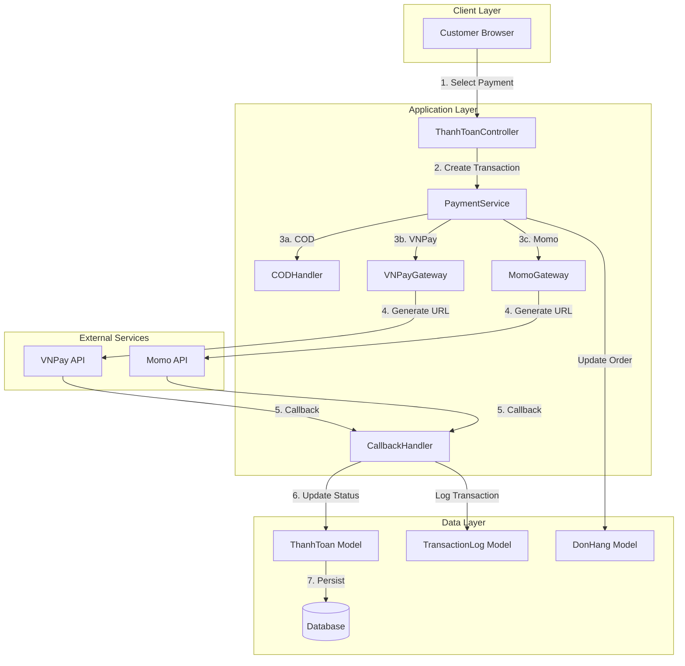

# Design Document: Payment Gateway Integration

## Overview

This document provides the technical design for integrating three payment methods into the e-commerce PHP application: Cash on Delivery (COD), VNPay online payment gateway, and Momo e-wallet. The design focuses on creating a flexible, secure, and maintainable payment processing system that handles transaction lifecycle, callback processing, error handling, and admin management.

### Design Goals

- **Security**: Implement cryptographic signature verification for all gateway communications
- **Reliability**: Handle network failures, timeouts, and duplicate transactions gracefully
- **Maintainability**: Use service-oriented architecture with clear separation of concerns
- **Extensibility**: Design allows easy addition of new payment gateways
- **User Experience**: Provide clear feedback and error messages in Vietnamese

### Technology Stack

- **Backend**: PHP 7.4+ with MVC architecture
- **Database**: MySQL 8.0+ with InnoDB engine
- **Payment Gateways**: VNPay API, Momo API
- **Security**: HMAC-SHA256/SHA512 for signature verification
- **Configuration**: Environment variables via .env file

## Architecture

### System Architecture



### Component Architecture

The payment system follows a service-oriented architecture with clear separation of concerns:

**Controller Layer** (`ThanhToanController`)
- Handles HTTP requests and responses
- Validates user input
- Orchestrates payment flow
- Manages session and authentication

**Service Layer** (`PaymentService`)
- Implements business logic for payment processing
- Coordinates between gateways and models
- Handles transaction state management
- Implements retry and timeout logic

**Gateway Layer** (`VNPayGateway`, `MomoGateway`, `CODHandler`)
- Encapsulates gateway-specific API integration
- Generates payment URLs and signatures
- Verifies callback signatures
- Maps gateway error codes to application errors

**Model Layer** (`ThanhToan`, `DonHang`, `TransactionLog`)
- Provides data access abstraction
- Implements database transactions
- Enforces data integrity constraints

**Callback Handler** (`CallbackHandler`)
- Receives and validates gateway callbacks
- Implements idempotency checks
- Updates transaction and order status
- Logs all callback events

### Payment Flow Sequence

```mermaid
sequenceDiagram
    participant C as Customer
    participant App as Application
    participant PS as PaymentService
    participant GW as Gateway
    participant DB as Database
    
    C->>App: Select payment method
    App->>PS: createTransaction(order, method)
    PS->>DB: Create transaction record
    DB-->>PS: transaction_id
    
    alt VNPay/Momo
        PS->>GW: generatePaymentURL(transaction)
        GW->>GW: Calculate signature
        GW-->>PS: payment_url
        PS-->>App: redirect_url
        App-->>C: Redirect to gateway
        C->>GW: Complete payment
        GW->>App: Callback (IPN)
        App->>App: Verify signature
        App->>DB: Update transaction status
        GW->>C: Redirect to return URL
        C->>App: View payment result
    else COD
        PS->>DB: Create pending transaction
        PS->>DB: Update order status
        PS-->>App: success
        App-->>C: Order confirmation
    end
