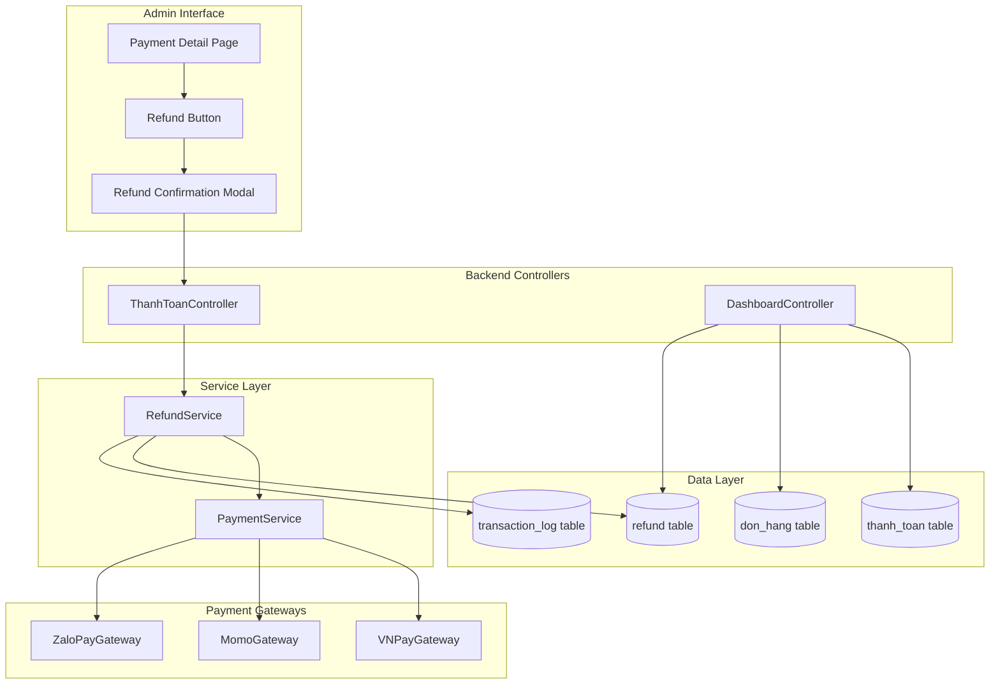
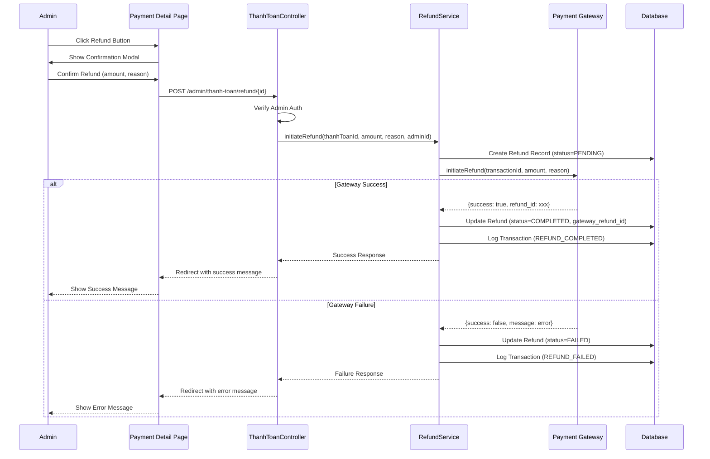
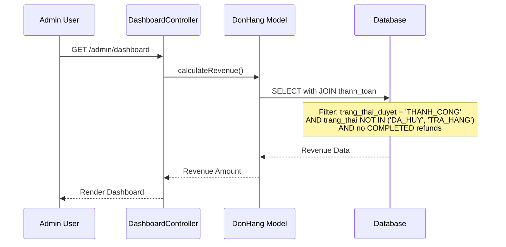

# Design Document: Refund and Revenue Calculation Fix

## Overview

This design addresses two critical business logic issues in the e-commerce payment system:

1. **Admin Refund Processing**: Implementing a complete refund workflow that allows administrators to initiate refunds for approved payments through the admin payment detail page, with full integration to payment gateways (VNPay, Momo) and proper tracking.

2. **Revenue Calculation Correction**: Fixing the dashboard revenue calculation to only count orders where payment is both successful AND approved by admin (`trang_thai_duyet = 'THANH_CONG'`), and excluding refunded payments.

Currently, the system has a `refund` table and `Refund` model with basic CRUD operations, and payment gateways have `initiateRefund()` methods, but there is no UI or workflow to trigger refunds. Additionally, the dashboard calculates revenue from all orders except cancelled/returned orders, ignoring the payment approval status.

### Key Design Decisions

- **Refund Button Visibility**: The refund button will only be visible for approved payments (`THANH_CONG`) that haven't been refunded yet, and will be hidden for COD and ZaloPay payments
- **Refund Service Layer**: A new `RefundService` class will orchestrate refund operations, gateway calls, and transaction logging
- **Revenue Query Optimization**: Revenue calculations will use JOIN with `thanh_toan` table to filter by approval status and exclude refunded payments
- **Transaction Logging**: All refund attempts will be logged to `transaction_log` table for audit purposes

## Architecture

### High-Level Component Diagram



### Refund Workflow Sequence



### Revenue Calculation Flow



## Components and Interfaces

### 1. RefundService (New Component)

**Location**: `app/services/refund/RefundService.php`

**Responsibilities**:
- Orchestrate refund workflow
- Call payment gateway refund APIs
- Update refund records
- Log refund transactions

**Public Methods**:

```php
class RefundService
{
    /**
     * Initiate a refund for a payment
     * 
     * @param int $thanhToanId Payment ID
     * @param float $amount Refund amount
     * @param string $reason Refund reason
     * @param int $adminId Admin user ID who initiated refund
     * @return array ['success' => bool, 'message' => string, 'refund_id' => int|null]
     */
    public function initiateRefund(int $thanhToanId, float $amount, string $reason, int $adminId): array;
    
    /**
     * Check if a payment can be refunded
     * 
     * @param array $thanhToan Payment record
     * @return array ['can_refund' => bool, 'reason' => string]
     */
    public function canRefund(array $thanhToan): array;
}
```

### 2. ThanhToanController (Modified)

**New Methods**:

```php
/**
 * Display refund initiation form/modal
 * GET /admin/thanh-toan/refund/{id}
 */
public function showRefundForm($id): void;

/**
 * Process refund request
 * POST /admin/thanh-toan/refund/{id}
 */
public function processRefund($id): void;
```

### 3. DashboardController (Modified)

**Modified Methods**:

```php
/**
 * Calculate monthly revenue with corrected logic
 * - Only include orders with THANH_CONG payment approval
 * - Exclude orders with COMPLETED refunds
 */
private function calculateMonthlyRevenue(): float;

/**
 * Calculate total revenue with corrected logic
 */
private function calculateTotalRevenue(): float;
```

### 4. Refund Model (Modified)

**New Methods**:

```php
/**
 * Check if payment has any completed refunds
 * 
 * @param int $thanhToanId Payment ID
 * @return bool
 */
public function hasCompletedRefund(int $thanhToanId): bool;

/**
 * Get refund statistics for a payment
 * 
 * @param int $thanhToanId Payment ID
 * @return array ['total_refunded' => float, 'refund_count' => int]
 */
public function getRefundStats(int $thanhToanId): array;
```

## Data Models

### Database Schema Changes

**No new tables required**. The existing `refund` table structure is sufficient:

```sql
CREATE TABLE `refund` (
    `id` INT NOT NULL AUTO_INCREMENT,
    `thanh_toan_id` INT NOT NULL,
    `amount` DECIMAL(15,2) NOT NULL,
    `status` ENUM('PENDING', 'COMPLETED', 'FAILED') DEFAULT 'PENDING',
    `reason` TEXT,
    `gateway_refund_id` VARCHAR(255) DEFAULT NULL,
    `created_at` DATETIME DEFAULT CURRENT_TIMESTAMP,
    `completed_at` DATETIME DEFAULT NULL,
    `admin_id` INT DEFAULT NULL,
    PRIMARY KEY (`id`),
    FOREIGN KEY (`thanh_toan_id`) REFERENCES `thanh_toan`(`id`),
    FOREIGN KEY (`admin_id`) REFERENCES `nguoi_dung`(`id`)
) ENGINE=InnoDB DEFAULT CHARSET=utf8mb4 COLLATE=utf8mb4_unicode_ci;
```

**Note**: The `admin_id` field needs to be added to track which admin initiated the refund.

### Migration Required

```sql
-- Add admin_id column to refund table
ALTER TABLE `refund` 
ADD COLUMN `admin_id` INT DEFAULT NULL AFTER `completed_at`,
ADD CONSTRAINT `fk_refund_admin` FOREIGN KEY (`admin_id`) REFERENCES `nguoi_dung`(`id`) ON DELETE SET NULL;
```

## API Endpoints

### Admin Refund Endpoints

#### 1. Show Refund Form
- **URL**: `/admin/thanh-toan/refund/{id}`
- **Method**: GET
- **Auth**: Admin only
- **Response**: Renders refund confirmation modal/page

#### 2. Process Refund
- **URL**: `/admin/thanh-toan/refund/{id}`
- **Method**: POST
- **Auth**: Admin only
- **Request Body**:
  ```json
  {
    "amount": 1500000,
    "reason": "Khách hàng yêu cầu hoàn tiền do sản phẩm lỗi"
  }
  ```
- **Success Response**: Redirect to `/admin/thanh-toan/chi-tiet?id={id}&success=refund_completed`
- **Error Response**: Redirect to `/admin/thanh-toan/chi-tiet?id={id}&error=refund_failed`

### Route Configuration

**File**: `app/routes/admin/admin.php`

```php
// Refund routes
$router->get('/admin/thanh-toan/refund', [ThanhToanController::class, 'showRefundForm']);
$router->post('/admin/thanh-toan/refund', [ThanhToanController::class, 'processRefund']);
```

## UI/UX Design

### Payment Detail Page Modifications

**File**: `app/views/admin/thanh_toan/detail.php`

#### Refund Button Display Logic

```php
<?php
// Determine if refund button should be shown
$canShowRefund = false;
$refundDisabledReason = '';

if ($thanhToan['trang_thai_duyet'] === 'THANH_CONG') {
    // Check if already refunded
    $hasRefund = !empty($refunds) && array_filter($refunds, fn($r) => $r['status'] === 'COMPLETED');
    
    if ($hasRefund) {
        $refundDisabledReason = 'Đã hoàn tiền';
    } elseif ($thanhToan['phuong_thuc'] === 'COD') {
        $refundDisabledReason = 'Không hỗ trợ hoàn tiền COD';
    } elseif ($thanhToan['phuong_thuc'] === 'ZaloPay') {
        $refundDisabledReason = 'ZaloPay chưa hỗ trợ hoàn tiền';
    } else {
        $canShowRefund = true;
    }
}
?>

<!-- Refund Button -->
<?php if ($canShowRefund): ?>
    <button type="button" class="btn btn-warning" data-bs-toggle="modal" data-bs-target="#refundModal">
        <i class="fas fa-undo"></i> Hoàn tiền
    </button>
<?php elseif ($refundDisabledReason): ?>
    <button type="button" class="btn btn-secondary" disabled title="<?= htmlspecialchars($refundDisabledReason) ?>">
        <i class="fas fa-undo"></i> Hoàn tiền
    </button>
<?php endif; ?>
```

#### Refund Confirmation Modal

```html
<!-- Refund Modal -->
<div class="modal fade" id="refundModal" tabindex="-1">
    <div class="modal-dialog">
        <div class="modal-content">
            <form method="POST" action="/admin/thanh-toan/refund?id=<?= $thanhToan['id'] ?>">
                <div class="modal-header">
                    <h5 class="modal-title">Xác nhận hoàn tiền</h5>
                    <button type="button" class="btn-close" data-bs-dismiss="modal"></button>
                </div>
                <div class="modal-body">
                    <div class="alert alert-warning">
                        <i class="fas fa-exclamation-triangle"></i>
                        Hành động này sẽ hoàn tiền cho khách hàng qua cổng thanh toán.
                    </div>
                    
                    <div class="mb-3">
                        <label class="form-label">Số tiền hoàn</label>
                        <input type="number" class="form-control" name="amount" 
                               value="<?= $thanhToan['so_tien'] ?>" readonly>
                    </div>
                    
                    <div class="mb-3">
                        <label class="form-label">Lý do hoàn tiền <span class="text-danger">*</span></label>
                        <textarea class="form-control" name="reason" rows="3" required 
                                  placeholder="Nhập lý do hoàn tiền..."></textarea>
                    </div>
                </div>
                <div class="modal-footer">
                    <button type="button" class="btn btn-secondary" data-bs-dismiss="modal">Hủy</button>
                    <button type="submit" class="btn btn-warning">Xác nhận hoàn tiền</button>
                </div>
            </form>
        </div>
    </div>
</div>
```

#### Refund History Display

```html
<!-- Refund History Section -->
<?php if (!empty($refunds)): ?>
<div class="card mt-3">
    <div class="card-header">
        <h5 class="mb-0">Lịch sử hoàn tiền</h5>
    </div>
    <div class="card-body">
        <table class="table table-bordered">
            <thead>
                <tr>
                    <th>Số tiền</th>
                    <th>Trạng thái</th>
                    <th>Lý do</th>
                    <th>Mã GD Gateway</th>
                    <th>Ngày tạo</th>
                    <th>Ngày hoàn thành</th>
                </tr>
            </thead>
            <tbody>
                <?php foreach ($refunds as $refund): ?>
                <tr>
                    <td><?= number_format($refund['amount'], 0, ',', '.') ?> đ</td>
                    <td>
                        <?php if ($refund['status'] === 'COMPLETED'): ?>
                            <span class="badge bg-success">Hoàn thành</span>
                        <?php elseif ($refund['status'] === 'PENDING'): ?>
                            <span class="badge bg-warning">Đang xử lý</span>
                        <?php else: ?>
                            <span class="badge bg-danger">Thất bại</span>
                        <?php endif; ?>
                    </td>
                    <td><?= htmlspecialchars($refund['reason'] ?? '') ?></td>
                    <td><?= htmlspecialchars($refund['gateway_refund_id'] ?? 'N/A') ?></td>
                    <td><?= date('d/m/Y H:i', strtotime($refund['created_at'])) ?></td>
                    <td><?= $refund['completed_at'] ? date('d/m/Y H:i', strtotime($refund['completed_at'])) : 'N/A' ?></td>
                </tr>
                <?php endforeach; ?>
            </tbody>
        </table>
    </div>
</div>
<?php endif; ?>
```

### Dashboard Revenue Display

**File**: `app/views/admin/dashboard/index.php`

No UI changes required. The revenue calculation logic will be updated in the controller to reflect corrected values.

## Error Handling

### Error Scenarios and Responses

#### 1. Payment Not Found
- **Trigger**: Invalid payment ID
- **Response**: Redirect to `/admin/thanh-toan?error=payment_not_found`
- **Message**: "Không tìm thấy thông tin thanh toán"

#### 2. Payment Not Approved
- **Trigger**: Attempting to refund payment with status != THANH_CONG
- **Response**: Redirect to `/admin/thanh-toan/chi-tiet?id={id}&error=payment_not_approved`
- **Message**: "Chỉ có thể hoàn tiền cho thanh toán đã được duyệt"

#### 3. Already Refunded
- **Trigger**: Payment already has COMPLETED refund
- **Response**: Redirect to `/admin/thanh-toan/chi-tiet?id={id}&error=already_refunded`
- **Message**: "Thanh toán này đã được hoàn tiền"

#### 4. Gateway Not Configured
- **Trigger**: Payment gateway credentials missing
- **Response**: Redirect to `/admin/thanh-toan/chi-tiet?id={id}&error=gateway_not_configured`
- **Message**: "Cổng thanh toán chưa được cấu hình"

#### 5. Gateway API Failure
- **Trigger**: Gateway returns error response
- **Response**: Redirect to `/admin/thanh-toan/chi-tiet?id={id}&error=gateway_failure`
- **Message**: Display gateway error message (from `getErrorMessage()`)

#### 6. Unsupported Payment Method
- **Trigger**: Attempting to refund COD or ZaloPay
- **Response**: Redirect to `/admin/thanh-toan/chi-tiet?id={id}&error=unsupported_method`
- **Message**: "Phương thức thanh toán này không hỗ trợ hoàn tiền tự động"

#### 7. Unauthorized Access
- **Trigger**: Non-admin user attempting refund
- **Response**: Redirect to `/admin/auth/login`
- **Message**: Session-based authentication check

### Error Logging Strategy

All refund operations will be logged to `transaction_log` table:

```php
// Success log
$transactionLogModel->logRequest($thanhToanId, 'REFUND', [
    'action' => 'REFUND_COMPLETED',
    'refund_id' => $refundId,
    'amount' => $amount,
    'gateway_refund_id' => $gatewayRefundId,
    'admin_id' => $adminId,
    'timestamp' => date('Y-m-d H:i:s')
]);

// Failure log
$transactionLogModel->logRequest($thanhToanId, 'REFUND', [
    'action' => 'REFUND_FAILED',
    'refund_id' => $refundId,
    'amount' => $amount,
    'error' => $errorMessage,
    'admin_id' => $adminId,
    'timestamp' => date('Y-m-d H:i:s')
]);
```

## Testing Strategy

### Unit Tests

**Test Coverage**:

1. **RefundService Tests**
   - Test `initiateRefund()` with valid payment
   - Test `initiateRefund()` with invalid payment
   - Test `canRefund()` for various payment states
   - Test gateway integration (mocked)

2. **Refund Model Tests**
   - Test `createRefund()` creates record with PENDING status
   - Test `updateRefundStatus()` updates status and timestamps
   - Test `hasCompletedRefund()` returns correct boolean
   - Test `getRefundStats()` calculates totals correctly

3. **Revenue Calculation Tests**
   - Test revenue excludes unapproved payments
   - Test revenue excludes refunded payments
   - Test revenue excludes cancelled/returned orders
   - Test revenue includes only THANH_CONG payments

### Integration Tests

1. **Refund Workflow Test**
   - Create approved payment
   - Initiate refund through admin interface
   - Verify refund record created
   - Verify gateway API called (with mock)
   - Verify transaction log created

2. **Revenue Calculation Test**
   - Create mix of approved/unapproved payments
   - Create refunded payment
   - Calculate revenue
   - Verify only approved, non-refunded payments counted

### Manual Testing Checklist

- [ ] Refund button visible only for approved payments
- [ ] Refund button hidden for COD payments
- [ ] Refund button hidden for ZaloPay payments
- [ ] Refund button hidden for already refunded payments
- [ ] Refund modal displays correct amount
- [ ] Refund reason is required
- [ ] Successful refund shows success message
- [ ] Failed refund shows error message
- [ ] Refund history displays correctly
- [ ] Dashboard revenue excludes refunded payments
- [ ] Dashboard revenue excludes unapproved payments

## Implementation Notes

### Phase 1: Refund Service and Model Updates

1. Create `RefundService` class
2. Add `admin_id` column to `refund` table
3. Update `Refund` model with new methods
4. Add refund routes to admin router

### Phase 2: Controller and UI Implementation

1. Add refund methods to `ThanhToanController`
2. Update payment detail view with refund button and modal
3. Add refund history display
4. Implement error handling and flash messages

### Phase 3: Revenue Calculation Fix

1. Update `DashboardController` revenue queries
2. Add JOIN with `thanh_toan` table
3. Add LEFT JOIN with `refund` table to exclude completed refunds
4. Test revenue calculations with various scenarios

### Phase 4: Testing and Validation

1. Write unit tests for RefundService
2. Write integration tests for refund workflow
3. Manual testing of all scenarios
4. Performance testing of revenue queries

## Security Considerations

1. **Authorization**: Only admin users can initiate refunds (enforced by `AdminMiddleware`)
2. **CSRF Protection**: Refund form includes CSRF token (if implemented)
3. **Input Validation**: Refund amount and reason are validated server-side
4. **Audit Trail**: All refund attempts logged with admin ID and timestamp
5. **Gateway Security**: Use HTTPS for all gateway API calls
6. **SQL Injection**: Use prepared statements for all database queries

## Performance Considerations

1. **Revenue Query Optimization**: Add index on `thanh_toan.trang_thai_duyet` for faster filtering
2. **Refund Lookup**: Add index on `refund.thanh_toan_id` for faster refund checks
3. **Transaction Logging**: Use asynchronous logging for non-critical logs
4. **Gateway Timeout**: Set reasonable timeout (30s) for gateway API calls

### Recommended Indexes

```sql
-- Index for revenue calculation
CREATE INDEX idx_thanh_toan_duyet ON thanh_toan(trang_thai_duyet);

-- Index for refund lookup
CREATE INDEX idx_refund_thanh_toan ON refund(thanh_toan_id, status);

-- Composite index for dashboard queries
CREATE INDEX idx_don_hang_revenue ON don_hang(trang_thai, ngay_tao);
```

## Deployment Checklist

- [ ] Run database migration to add `admin_id` column
- [ ] Create recommended indexes
- [ ] Deploy `RefundService` class
- [ ] Deploy updated controllers and models
- [ ] Deploy updated views
- [ ] Update admin routes
- [ ] Test refund workflow in staging
- [ ] Test revenue calculations in staging
- [ ] Monitor gateway API calls
- [ ] Monitor transaction logs
- [ ] Update admin documentation

## Future Enhancements

1. **Partial Refunds**: Support refunding partial amounts instead of full payment
2. **Bulk Refunds**: Allow admins to refund multiple payments at once
3. **Refund Notifications**: Send email/SMS to customers when refund is processed
4. **Refund Reports**: Generate reports of all refunds by date range, gateway, etc.
5. **Automatic Refunds**: Trigger refunds automatically when order is cancelled
6. **ZaloPay Refund Support**: Implement when ZaloPay API supports refunds
7. **Refund Approval Workflow**: Require manager approval for large refunds
